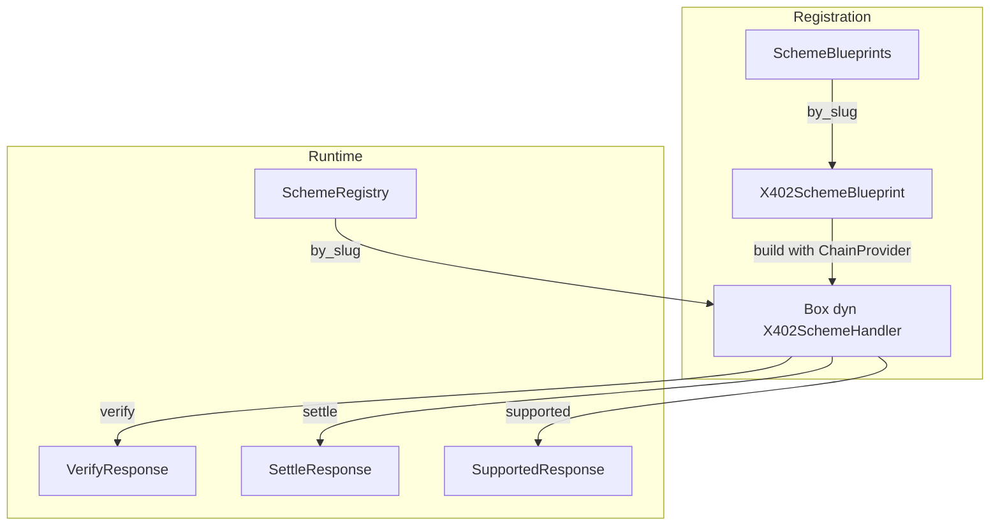

# How to Write a Scheme for x402-rs

This guide explains how to create a custom payment scheme for the x402 facilitator.

## What is a Scheme?

A **scheme** defines how a payment is verified and settled on a specific blockchain. It encapsulates:

- **Payload format** — The structure of payment data (signatures, transactions, authorizations)
- **Verification logic** — How to validate a payment is correct before execution
- **Settlement logic** — How to execute the payment on-chain
- **Supported chains** — Which blockchain networks the scheme works with

For example, the `exact` scheme implements ERC-3009 `transferWithAuthorization` for EVM chains and SPL token transfers for Solana. You might create a new scheme for subscription payments, escrow flows, or alternative token standards.

## Overview

| Concept               | Open/Closed | Description                                                                                                           |
|-----------------------|-------------|-----------------------------------------------------------------------------------------------------------------------|
| **Schemes**           | **Open**    | Widely extensible. Anyone can create custom schemes for new payment flows.                                            |
| **Protocol Versions** | Closed      | Fixed set: v1 and v2. Defined by the x402 specification. (v1 is legacy, v2 will probably live for the next few years) |
| **Chain Providers**   | Closed      | Predefined set for the implementation due to chain-specific complexity.                                               |

## Architecture



## Naming Convention

Scheme types follow the pattern: `V{version}{ChainNamespace}{SchemeName}`

| Slug | Struct Name | Directory |
|------|-------------|-----------|
| `v2:solana:exact` | `V2SolanaExact` | `v2_solana_exact/` |
| `v1:eip155:exact` | `V1Eip155Exact` | `v1_eip155_exact/` |
| `v2:solana:myscheme` | `V2SolanaMyscheme` | `v2_solana_myscheme/` |

This makes it easy to map between slugs, chain namespaces, and scheme names.

## Core Traits and Structs

### SchemeSlug

A scheme is identified internally by a slug: `v{version}:{namespace}:{name}`

```rust
SchemeSlug::new(2, "solana", "exact") // → "v2:solana:exact"
```

The slug uniquely identifies a registered scheme per x402 payload at runtime.

### X402SchemeBlueprint

Factory for creating scheme handlers:

```rust
pub trait X402SchemeBlueprint {
    fn slug(&self) -> SchemeSlug;
    fn build(
        &self,
        provider: ChainProvider,
        config: Option<serde_json::Value>,
    ) -> Result<Box<dyn X402SchemeHandler>, Box<dyn std::error::Error>>;
}
```

- The `build` method receives a `ChainProvider` enum—match against the expected variant
- The optional `config` allows scheme-specific configuration (parse however you wish)

### X402SchemeHandler

Three core operations every scheme must implement:

```rust
#[async_trait::async_trait]
pub trait X402SchemeHandler: Send + Sync {
    async fn verify(&self, request: &proto::VerifyRequest) 
        -> Result<proto::VerifyResponse, FacilitatorLocalError>;
    async fn settle(&self, request: &proto::SettleRequest) 
        -> Result<proto::SettleResponse, FacilitatorLocalError>;
    async fn supported(&self) 
        -> Result<proto::SupportedResponse, FacilitatorLocalError>;
}
```

| Method      | Purpose                                            |
|-------------|----------------------------------------------------|
| `verify`    | Validate a payment without executing it.           |
| `settle`    | Execute the payment on-chain.                      |
| `supported` | Advertise what payment kinds this scheme supports. |

## Step-by-Step Guide

### Step 1: Define Types

Use proto generics. For v2 schemes:

```rust
use crate::proto::v2;

pub type PaymentRequirements = v2::PaymentRequirements<MyScheme, MyAmountType, MyAddressType, MyExtra>;
pub type PaymentPayload = v2::PaymentPayload<PaymentRequirements, MyPayload>;
pub type VerifyRequest = v2::VerifyRequest<PaymentPayload, PaymentRequirements>;
pub type SettleRequest = VerifyRequest;
```

### Step 2: Implement Blueprint

```rust
pub struct V2SolanaMyscheme;

impl X402SchemeBlueprint for V2SolanaMyscheme {
    fn slug(&self) -> SchemeSlug {
        SchemeSlug::new(2, "solana", "myscheme")
    }

    fn build(&self, provider: ChainProvider, config: Option<serde_json::Value>)
        -> Result<Box<dyn X402SchemeHandler>, Box<dyn Error>>
    {
        let provider = match provider {
            ChainProvider::Solana(p) => p,
            _ => return Err("Requires SolanaChainProvider".into()),
        };
        // Optionally parse config here
        Ok(Box::new(V2SolanaMyschemeHandler { provider }))
    }
}
```

### Step 3: Implement Handler

```rust
#[async_trait::async_trait]
impl X402SchemeHandler for V2SolanaMyschemeHandler {
    async fn verify(&self, request: &proto::VerifyRequest)
        -> Result<proto::VerifyResponse, FacilitatorLocalError>
    {
        let request = types::VerifyRequest::from_proto(request.clone())
            .ok_or(FacilitatorLocalError::DecodingError("...".into()))?;
        // Your verification logic...
        Ok(proto::v2::VerifyResponse::valid(payer).into())
    }

    async fn settle(&self, request: &proto::SettleRequest)
        -> Result<proto::SettleResponse, FacilitatorLocalError>
    {
        // Your settlement logic...
        Ok(proto::v2::SettleResponse::Success { payer, transaction, network }.into())
    }

    async fn supported(&self) -> Result<proto::SupportedResponse, FacilitatorLocalError> {
        Ok(proto::SupportedResponse {
            kinds: vec![proto::SupportedPaymentKind { ... }],
            extensions: Vec::new(),
            signers,
        })
    }
}
```

### Step 4: Register the Scheme

For custom facilitators, register dynamically:
```rust
let blueprints = SchemeBlueprints::new().and_register(V2SolanaMyscheme);
```

### Step 5: Configure in JSON

```json
{
  "schemes": [
    {
      "enabled": true,
      "slug": "v2:solana:myscheme",
      "chains": "solana:*",
      "config": { "yourOption": "value" }
    }
  ]
}
```

- `chains`: Pattern matching (`*` for all, `{a,b}` for specific)
- `config`: Passed to your `build()` method

## Contributing to Upstream x402-rs

If you want your scheme included in the default x402-rs distribution:

1. Create module structure under `src/scheme/v2_solana_myscheme/`
2. Add module declaration in `src/scheme/mod.rs`:
   ```rust
   pub mod v2_solana_myscheme;
   ```
3. Register in `SchemeBlueprints::full()`:
   ```rust
   .and_register(V2SolanaMyscheme)
   ```

## Summary Checklist

- [ ] Define types using proto v2 generics
- [ ] Implement `X402SchemeBlueprint` with correct slug
- [ ] Implement `X402SchemeHandler` (verify/settle/supported)
- [ ] Register in `SchemeBlueprints`
- [ ] Configure in `config.json`
