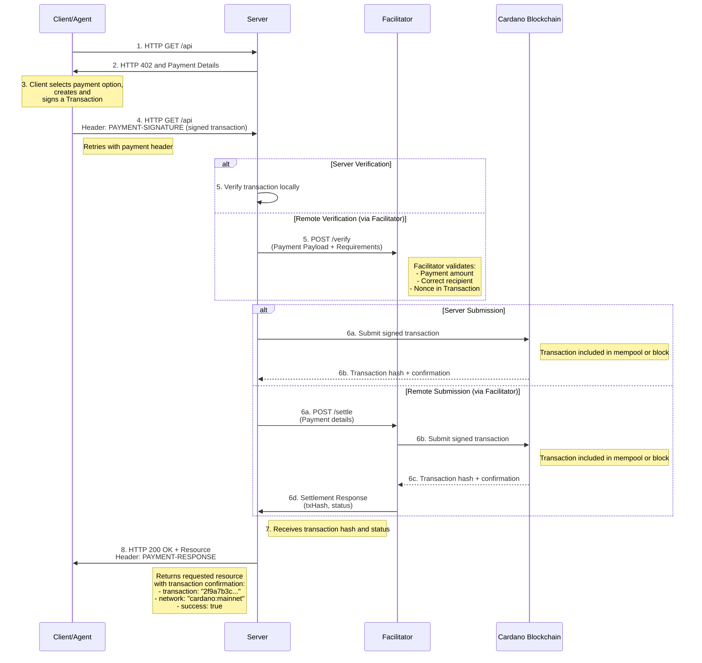

# Scheme: exact on Cardano

## Summary

This document specifies the `exact` payment scheme for the x402 protocol on Cardano. This scheme facilitates payments of Cardano Native Tokens.

It offers different assetTransferMethods to do x402 interactions:

1. Doing **Address-To-Address** Payments, similar to the regular x402 specifications on other chains.

2. Using the **Masumi Smart Protocol**, which offers additional refund mechanics & decision logging mechanisms in a decentralised way.

3. Performing payments to scripts using parameters that can be applied to scripts while transaction building.
## Protocol Flow



The protocol flow for `exact` on Cardano is client-driven. 

1.  **Client** makes an HTTP request to a **Resource Server**.

2.  **Resource Server** responds with a `402 Payment Required` status, detailing the payment information:
    - If using the Masumi Protocol, the `extra` field will contain additional information required to build a Masumi Smart Contract interaction.
    - If using Address-To-Address payments, the `payTo` field will contain the address to which the payment must be sent.
    - If using Script payments, the `extra` field will contain parameters to be applied to scripts during transaction building.

3.  **Client** constructs the transaction body, signs it, and returns it to the **Resource Server** via the `PAYMENT-SIGNATURE` header.

4.  **Resource Server** verifies the transaction is valid:
    - **Local verification**: The server validates the transaction structure, amount, and recipient address directly.
    - **Remote verification**: The server forwards the `PAYMENT-SIGNATURE` header and `paymentRequirements` to a **Facilitator's** `/verify` endpoint to check if the transaction is valid.

5.  After successful verification, the signed transaction is submitted to the Cardano blockchain:
    - **Server submission**: The **Resource Server** submits the transaction directly to the Cardano blockchain.
    - **Facilitator submission**: The **Resource Server** sends the transaction to the **Facilitator's** `/settle` endpoint, which then submits it to the blockchain.

6.  The Cardano blockchain includes the transaction in the mempool or a block and returns the transaction hash and confirmation status.

7.  **Resource Server** receives the transaction hash and status:
    - If submitted via the **Facilitator**, it receives a settlement response containing the `txHash` and `status`.
    - Cardano uses Ouroboros Praos, which has probabilistic finality. A transaction that appears in the mempool or even in a recent block can be rolled back. Granting access upon mempool inclusion (`status: "mempool"`) is therefore **strongly discouraged** and SHOULD NOT be used for any resource with real economic value. Servers that choose to accept mempool status MUST document this risk and accept full liability for rolled-back transactions.

8.  **Resource Server** grants the **Client** access to the requested resource, returning an HTTP 200 OK response with an `PAYMENT-RESPONSE` header containing:
    - `txHash`: The Cardano transaction hash
    - `network`: The Cardano network (e.g., `cardano:mainnet`)
    - `status`: The transaction status (e.g., `confirmed` or `mempool`)

### `PaymentRequirementsResponse`

#### Default Schema

When the Resource Server responds with a `402 Payment Required`, the body of the response contains the payment requirements in the following schema:

```js
{
  "x402Version": 2,
  "error": "PAYMENT-SIGNATURE header is required",
  "resource": {
    "url": "https://api.example.com/premium-data",
    "description": "Access to premium market data",
    "mimeType": "application/json"
  },
  "accepts": [
    {
      "scheme": "exact",
      "network": "cardano:mainnet", // cardano:preprod or cardano:preview for public testnets
      "amount": "10000", // 1 USDM = 1000000000
      "asset": "c48cbb3d5e57ed56e276bc45f99ab39abe94e6cd7ac39fb402da47ad.0014df105553444d", // ${policyId}.${assetName} The policy id in this example is the USDM policy id on Cardano Mainnet - use 16a55b2a349361ff88c03788f93e1e966e5d689605d044fef722ddde for USDM on Preprod. The asset name is the hex representation of '(333) USDM'
      "payTo": "addr1...",
      "maxTimeoutSeconds": 600, // Has to be set to a higher amount of time because of the Cardano Network speed
      "extra": {
        // In case of default address-to-address payments, this may be empty or contain additional metadata
      }
    }
  ]
}
```

#### Masumi assetTransferMethod Schema

When the Resource Server requires payment via the Masumi Smart Protocol, the `extra` field in the `PaymentRequirementsResponse` contains additional fields required for Masumi interactions.

```js
{
  "x402Version": 2,
  "error": "PAYMENT-SIGNATURE header is required",
  "resource": {
    "url": "https://api.example.com/premium-data",
    "description": "Access to premium market data",
    "mimeType": "application/json"
  },
  "accepts": [
    {
      "scheme": "exact",
      "network": "cardano:mainnet", // cardano:preprod or cardano:preview for public testnets
      "amount": "10000", // 1 USDM = 1000000000
      "asset": "c48cbb3d5e57ed56e276bc45f99ab39abe94e6cd7ac39fb402da47ad.0014df105553444d", // ${policyId}.${assetName} The policy id in this example is the USDM policy id on Cardano Mainnet - use 16a55b2a349361ff88c03788f93e1e966e5d689605d044fef722ddde for USDM on Preprod. The asset name is the hex representation of '(333) USDM'
      "payTo": "addr1...",
      "maxTimeoutSeconds": 600, // Has to be set to a higher amount of time because of the Cardano Network speed
      "extra": {
        "assetTransferMethod": "masumi", // optional, can be "default" | "masumi" | "script"
        // If the masumi assetTransferMethod is used, make sure to include all masumi related fields
        "identifierFromPurchaser": "aabbaabb11221122aabb",
        "sellerVkey": "sdasdqweqwewewewqe",
        "paymentType": "Web3CardanoV1",
        "blockchainIdentifier": "blockchain_identifier",
        "payByTime": "1713626260",
        "submitResultTime": "1713636260",
        "unlockTime": "1713636260",
        "externalDisputeUnlockTime": "1713636260",
        "agentIdentifier": "agent_identifier",
        "inputHash": "9f86d081884c7d659a2feaa0c55ad015a3bf4f1b2b0b822cd15d6c15b0f00a08"
        // Additional fields for masumi or script assetTransferMethods can be added here
      }
    }
  ]
}
```

#### Script assetTransferMethod Schema

When the Resource Server requires payment to a script, the `extra` field in the `PaymentRequirementsResponse` contains additional fields required for script interactions.

```js
{
  "x402Version": 2,
  "error": "PAYMENT-SIGNATURE header is required",
  "resource": {
    "url": "https://api.example.com/premium-data",
    "description": "Access to premium market data",
    "mimeType": "application/json"
  },
  "accepts": [
    {
      "scheme": "exact",
      "network": "cardano:mainnet", // cardano:preprod or cardano:preview for public testnets
      "amount": "10000", // 1 USDM = 1000000000
      "asset": "c48cbb3d5e57ed56e276bc45f99ab39abe94e6cd7ac39fb402da47ad.0014df105553444d", // ${policyId}.${assetName} The policy id in this example is the USDM policy id on Cardano Mainnet - use 16a55b2a349361ff88c03788f93e1e966e5d689605d044fef722ddde for USDM on Preprod. The asset name is the hex representation of '(333) USDM'
      "payTo": "addr1...", // In case of script payments, this is the script address (the address should match the script provided in extra after applying parameters. In case of additional parameters provided, the client needs to pass the additional parameters to the server in the PAYMENT-SIGNATURE header, so that the server can reconstruct the script address and verify the payment)
      "maxTimeoutSeconds": 600, // Has to be set to a higher amount of time because of the Cardano Network speed
      "extra": {
        "assetTransferMethod": "script", // optional, can be "default" | "masumi" | "script"
        // If the script assetTransferMethod is used, make sure to include all script related fields
        "scriptHash": "script_hash_here", // If the script is already on-chain, provide its hash and the client can resolve the full script
        "script": {
          // Optional full script object if not on-chain yet
          "type": "plutusV3",
          "code": "<Hex-encoded script code here>",
        },
        "parameters": {
          "param1": {"value": "Hello World", "type": "bytes"},
          "param2": {"value": 42, "type": "bigint"}
          // Script-specific parameters required for transaction building
        }
        // Additional fields for script assetTransferMethods can be added here
      }
    }
  ]
}
```

### `PAYMENT-SIGNATURE` Header Payload

The PAYMENT-SIGNATURE header is base64-encoded and sent in the client's request to the resource server when paying for a resource.

The payload field of the PAYMENT-SIGNATURE header must contain the following fields:

transaction: The signed Cardano transaction (Base64 encoded).
Example:

```js
{
  "transaction": "AAAIAQDi1HwjSnS6M+WGvD73iEyUY2FRKNj0MlRp7+3SHZM3xCvMdB0AAAAAIFRgPKOstGBLCnbcyGoOXugUYAWwVzNrpMjPCzXK4KQWAQCMoE29VLGwftex8rhIlOuFLFNfxLIJlHqGXoXA8hx6l+LMdB0AAAAAIHbPucTRIEWgO6lzqukswPZ6i72IHEKK5LyM1l9HJNZNAQBthSeHDVK8Xr5/zp3JMZPLtG5uAoVgedTA4pEnp+h8qUlUzRwAAAAAIACH0swYW/QfGCFczGnjAVPHPqZrQE5vfvJr36i6KVEFAQAC7W4K5vCwB+nprjxcNlLiOQ7SIIfyCZjmj2qSis2iTsCuzBwAAAAAIAkSUkXOoeq52GNdhwpbs+jZqqrqPdmiN3oPw5EzDIanAQAIyFNGWD6OxiFIyXSxrNEcFG0npm+nImk6InUssXb1EZgx1hwAAAAAILhsjmMKyM0n75Cd7z6ufH2LNhOMibFOGhNlLgV5RFuEAQC+Mh4kGkLwrw/11729oUQnt3xOmOreE6PcnuN6M68ZBcCuzBwAAAAAIO2PQhSSqSAawCbRr005lfjBgFOqIHo4zb2GcQ/WCxAlAAgA+QKVAAAAAAAgjiAHD0X4HNSdVPpJtf2E6W2uRc8kbvCHYkgEQ1B+w1MDAwEAAAUBAQABAgABAwABBAABBQACAQAAAQEGAAEBAgEAAQcAHrfFfj8r0Pxsudz/0UPqlX5NmPgFw1hzP3be4GZ/4LEB5XXrONxGw0qOUsq3yNKeUhOCOgCIwaa4pswKaer66EKqPGwdAAAAACBrOIN4poutFUmHfB6FbFJu8GgXoPPTGQWREqFpPfvO1B63xX4/K9D8bLnc/9FD6pV+TZj4BcNYcz923uBmf+Cx7gIAAAAAAABg4xYAAAAAAAA="
}
```

Full PAYMENT-SIGNATURE header:

```js
{
  "x402Version": 2,
  "resource": {
    "url": "https://api.example.com/premium-data",
    "description": "Access to premium market data",
    "mimeType": "application/json"
  },
  "accepted": {
    "scheme": "exact",
    "network": "cardano:mainnet",
    "amount": "10000",
    "asset": "c48cbb3d5e57ed56e276bc45f99ab39abe94e6cd7ac39fb402da47ad.0014df105553444d",
    "payTo": "addr1...",
    "maxTimeoutSeconds": 600,
    "extra": {
      // In case of default address-to-address payments, this may be empty or contain additional metadata
    }
  },
  "payload": {
    "transaction": "AAAIAQDi1HwjSnS6M+WGvD73iEyUY2FRKNj0MlRp7+3SHZM3xCvMdB0AAAAAIFRgPKOstGBLCnbcyGoOXugUYAWwVzNrpMjPCzXK4KQWAQCMoE29VLGwftex8rhIlOuFLFNfxLIJlHqGXoXA8hx6l+LMdB0AAAAAIHbPucTRIEWgO6lzqukswPZ6i72IHEKK5LyM1l9HJNZNAQBthSeHDVK8Xr5/zp3JMZPLtG5uAoVgedTA4pEnp+h8qUlUzRwAAAAAIACH0swYW/QfGCFczGnjAVPHPqZrQE5vfvJr36i6KVEFAQAC7W4K5vCwB+nprjxcNlLiOQ7SIIfyCZjmj2qSis2iTsCuzBwAAAAAIAkSUkXOoeq52GNdhwpbs+jZqqrqPdmiN3oPw5EzDIanAQAIyFNGWD6OxiFIyXSxrNEcFG0npm+nImk6InUssXb1EZgx1hwAAAAAILhsjmMKyM0n75Cd7z6ufH2LNhOMibFOGhNlLgV5RFuEAQC+Mh4kGkLwrw/11729oUQnt3xOmOreE6PcnuN6M68ZBcCuzBwAAAAAIO2PQhSSqSAawCbRr005lfjBgFOqIHo4zb2GcQ/WCxAlAAgA+QKVAAAAAAAgjiAHD0X4HNSdVPpJtf2E6W2uRc8kbvCHYkgEQ1B+w1MDAwEAAAUBAQABAgABAwABBAABBQACAQAAAQEGAAEBAgEAAQcAHrfFfj8r0Pxsudz/0UPqlX5NmPgFw1hzP3be4GZ/4LEB5XXrONxGw0qOUsq3yNKeUhOCOgCIwaa4pswKaer66EKqPGwdAAAAACBrOIN4poutFUmHfB6FbFJu8GgXoPPTGQWREqFpPfvO1B63xX4/K9D8bLnc/9FD6pV+TZj4BcNYcz923uBmf+Cx7gIAAAAAAABg4xYAAAAAAAA="
    "nonce": "662cbf645fcd8914eb89115b83970a950493dd2fbaf39dea3b96e8cbdc132939#0"
  }
}
```

Expanded Schema based on assetTransferMethods:

#### Masumi assetTransferMethod

```js
{
  "x402Version": 2,
  "resource": {
    "url": "https://api.example.com/premium-data",
    "description": "Access to premium market data",
    "mimeType": "application/json"
  },
  "accepted": {
    "scheme": "exact",
    "network": "cardano:mainnet",
    "amount": "10000",
    "asset": "c48cbb3d5e57ed56e276bc45f99ab39abe94e6cd7ac39fb402da47ad.0014df105553444d",
    "payTo": "addr1...",
    "maxTimeoutSeconds": 600,
      "extra": {
        "assetTransferMethod": "masumi",
        "identifierFromPurchaser": "aabbaabb11221122aabb",
        "sellerVkey": "sdasdqweqwewewewqe",
        "paymentType": "Web3CardanoV1",
        "blockchainIdentifier": "blockchain_identifier",
        "payByTime": "1713626260",
        "submitResultTime": "1713636260",
        "unlockTime": "1713636260",
        "externalDisputeUnlockTime": "1713636260",
        "agentIdentifier": "agent_identifier",
        "inputHash": "9f86d081884c7d659a2feaa0c55ad015a3bf4f1b2b0b822cd15d6c15b0f00a08"
      }
  },
  "payload": {
    "transaction": "AAAIAQDi1HwjSnS6M+WGvD73iEyUY2FRKNj0MlRp7+3SHZM3xCvMdB0AAAAAIFRgPKOstGBLCnbcyGoOXugUYAWwVzNrpMjPCzXK4KQWAQCMoE29VLGwftex8rhIlOuFLFNfxLIJlHqGXoXA8hx6l+LMdB0AAAAAIHbPucTRIEWgO6lzqukswPZ6i72IHEKK5LyM1l9HJNZNAQBthSeHDVK8Xr5/zp3JMZPLtG5uAoVgedTA4pEnp+h8qUlUzRwAAAAAIACH0swYW/QfGCFczGnjAVPHPqZrQE5vfvJr36i6KVEFAQAC7W4K5vCwB+nprjxcNlLiOQ7SIIfyCZjmj2qSis2iTsCuzBwAAAAAIAkSUkXOoeq52GNdhwpbs+jZqqrqPdmiN3oPw5EzDIanAQAIyFNGWD6OxiFIyXSxrNEcFG0npm+nImk6InUssXb1EZgx1hwAAAAAILhsjmMKyM0n75Cd7z6ufH2LNhOMibFOGhNlLgV5RFuEAQC+Mh4kGkLwrw/11729oUQnt3xOmOreE6PcnuN6M68ZBcCuzBwAAAAAIO2PQhSSqSAawCbRr005lfjBgFOqIHo4zb2GcQ/WCxAlAAgA+QKVAAAAAAAgjiAHD0X4HNSdVPpJtf2E6W2uRc8kbvCHYkgEQ1B+w1MDAwEAAAUBAQABAgABAwABBAABBQACAQAAAQEGAAEBAgEAAQcAHrfFfj8r0Pxsudz/0UPqlX5NmPgFw1hzP3be4GZ/4LEB5XXrONxGw0qOUsq3yNKeUhOCOgCIwaa4pswKaer66EKqPGwdAAAAACBrOIN4poutFUmHfB6FbFJu8GgXoPPTGQWREqFpPfvO1B63xX4/K9D8bLnc/9FD6pV+TZj4BcNYcz923uBmf+Cx7gIAAAAAAABg4xYAAAAAAAA="
    "nonce": "662cbf645fcd8914eb89115b83970a950493dd2fbaf39dea3b96e8cbdc132939#0"
  }
}
```

#### Script assetTransferMethod

```js
{
  "x402Version": 2,
  "resource": {
    "url": "https://api.example.com/premium-data",
    "description": "Access to premium market data",
    "mimeType": "application/json"
  },
  "accepted": {
    "scheme": "exact",
    "network": "cardano:mainnet",
    "amount": "10000",
    "asset": "c48cbb3d5e57ed56e276bc45f99ab39abe94e6cd7ac39fb402da47ad.0014df105553444d",
    "payTo": "addr1...", // script address
    "maxTimeoutSeconds": 600,
      "extra": {
        "assetTransferMethod": "script",
        "scriptHash": "script_hash_here",
        "script": {
          "type": "plutusV3",
          "code": "<Hex-encoded script code here>"
        },
        "parameters": {
          "param1": {"value": "Hello World", "type": "bytes"},
          "param2": {"value": 42, "type": "bigint"}
        }
      }
  },
  "payload": {
    "transaction": "AAAIAQDi1HwjSnS6M+WGvD73iEyUY2FRKNj0MlRp7+3SHZM3xCvMdB0AAAAAIFRgPKOstGBLCnbcyGoOXugUYAWwVzNrpMjPCzXK4KQWAQCMoE29VLGwftex8rhIlOuFLFNfxLIJlHqGXoXA8hx6l+LMdB0AAAAAIHbPucTRIEWgO6lzqukswPZ6i72IHEKK5LyM1l9HJNZNAQBthSeHDVK8Xr5/zp3JMZPLtG5uAoVgedTA4pEnp+h8qUlUzRwAAAAAIACH0swYW/QfGCFczGnjAVPHPqZrQE5vfvJr36i6KVEFAQAC7W4K5vCwB+nprjxcNlLiOQ7SIIfyCZjmj2qSis2iTsCuzBwAAAAAIAkSUkXOoeq52GNdhwpbs+jZqqrqPdmiN3oPw5EzDIanAQAIyFNGWD6OxiFIyXSxrNEcFG0npm+nImk6InUssXb1EZgx1hwAAAAAILhsjmMKyM0n75Cd7z6ufH2LNhOMibFOGhNlLgV5RFuEAQC+Mh4kGkLwrw/11729oUQnt3xOmOreE6PcnuN6M68ZBcCuzBwAAAAAIO2PQhSSqSAawCbRr005lfjBgFOqIHo4zb2GcQ/WCxAlAAgA+QKVAAAAAAAgjiAHD0X4HNSdVPpJtf2E6W2uRc8kbvCHYkgEQ1B+w1MDAwEAAAUBAQABAgABAwABBAABBQACAQAAAQEGAAEBAgEAAQcAHrfFfj8r0Pxsudz/0UPqlX5NmPgFw1hzP3be4GZ/4LEB5XXrONxGw0qOUsq3yNKeUhOCOgCIwaa4pswKaer66EKqPGwdAAAAACBrOIN4poutFUmHfB6FbFJu8GgXoPPTGQWREqFpPfvO1B63xX4/K9D8bLnc/9FD6pV+TZj4BcNYcz923uBmf+Cx7gIAAAAAAABg4xYAAAAAAAA="
    "nonce": "662cbf645fcd8914eb89115b83970a950493dd2fbaf39dea3b96e8cbdc132939#0"
  }
}
```

### Facilitator Verification Rules

A facilitator MUST enforce all of the following rules before accepting a payment as valid. Any failure MUST result in a rejection.

1. **Network Validation**: The transaction MUST be destined for the correct Cardano network (mainnet, preprod, or preview) as declared in `PaymentRequirements.network`. The facilitator MUST reject transactions built for a different network.

2. **Recipient Verification**: At least one transaction output MUST send funds to the address specified in `PaymentRequirements.payTo`. The facilitator MUST NOT accept transactions where the recipient address differs from `payTo`.

3. **Amount Verification**: The output sent to `payTo` MUST contain a value greater than or equal to the amount declared in `PaymentRequirements.amount` for the asset identified by `PaymentRequirements.asset`. The facilitator MUST verify both the policy ID and the asset name match exactly.

4. **Asset Verification**: The asset unit in the transaction MUST exactly match `PaymentRequirements.asset` (format: `${policyId}.${assetNameHex}`). The facilitator MUST NOT accept a different asset, even one of equal market value.

5. **Nonce / Replay Prevention**: The `payload.nonce` MUST be a valid UTXO reference (`txHash#index`) that is included as an input in the transaction. The facilitator MUST verify that this UTXO exists in the current on-chain UTXO set and has not been spent. This ensures uniqueness and prevents replay attacks.

6. **TTL / Expiry Check**: The transaction's TTL (time-to-live slot) MUST not have already passed at the time of verification. The facilitator MUST reject transactions whose TTL is in the past. The TTL SHOULD be consistent with `PaymentRequirements.maxTimeoutSeconds`.

### `PAYMENT-RESPONSE` Header Payload

The `PAYMENT-RESPONSE` header is base64-encoded and returned to the client by the resource server.

Once decoded, the `PAYMENT-RESPONSE` is a JSON string with the following properties:

Schema:

```js
{
  "success": true, // true or false
  "network": "cardano:mainnet",
  "transaction": "2f9a7b3c..." // Transaction hash of the payment if successful
  "extensions": {
    "status": "confirmed", // "confirmed" is the recommended value; "mempool" is permitted but strongly discouraged — see settlement warning above
  }
  // Optional error field in case of failure
  "errorReason": "Utxo not found in utxo set" // Example error reason
}
```
