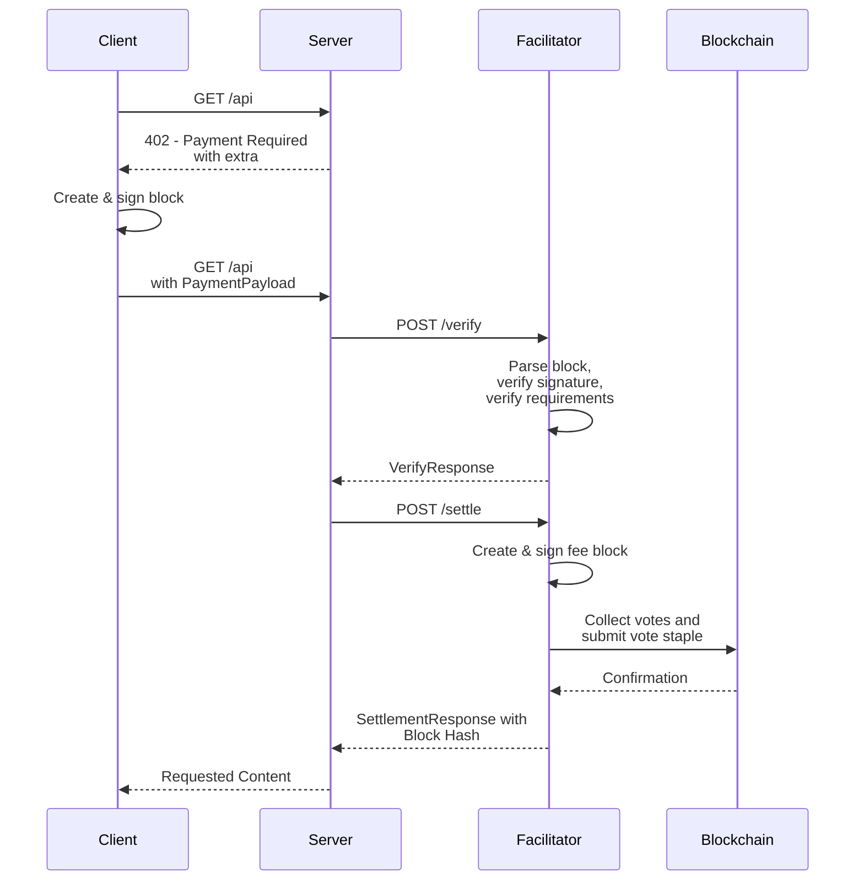

# Scheme: `exact` on `keeta`

## Summary

The `exact` scheme on Keeta transfers a specific amount of a token (such as USDC) on the Keeta network from the payer to the resource server.
The payer constructs a signed block containing a `SEND` operation to fulfill the `paymentRequirements`.
The facilitator sponsors network fees and cannot alter the signed block to redirect funds to any other address.

**Version Support:** This specification supports x402 v2 protocol only.

> [!NOTE]
> Non-sponsored fee flows (where the client pays network fees) are currently not supported. See [Non-Sponsored Fee Flows](#non-sponsored-fee-flows) for details.

## Protocol



1. **Client** makes a request to a **Resource Server**.
2. **Resource Server** responds with a payment required signal containing `PaymentRequired`.
3. **Client** creates and signs a block with a `SEND` operation to transfer the specified amount of the token to the recipient. If the `extra.external` field is set, the client sets the `external` field to the specified value in the `SEND` operation. The block is **not** published to the network.
4. **Client** serializes the signed block into its ASN.1 DER representation and encodes it as a Base64 string.
5. **Client** sends a new request to the **Resource Server** with the `PaymentPayload` containing the Base64-encoded signed block.
6. **Resource Server** receives the request and forwards the `PaymentPayload` and `PaymentRequirements` to a **Facilitator's** `/verify` endpoint.
7. **Facilitator** decodes and parses the signed block and verifies the block according to the [verification rules](#verification).
8. **Facilitator** returns a `VerifyResponse` to the **Resource Server**.
9. **Resource Server**, upon successful verification, forwards the payload to the facilitator's `/settle` endpoint.
10. **Facilitator** verifies the block according to the [settlement rules](#settlement). It computes and signs a fee block, requests votes for the blocks from the network's representatives and publishes the combined vote staple to the network.
11. Upon successful on-chain settlement, the **Facilitator** responds with a `SettlementResponse` including the hash of the client's payment block to the **Resource Server**.
12. **Resource Server** grants the **Client** access to the resource in its response.

## Payment header payload

### `PaymentRequirements` for `exact`

In addition to the standard x402 `PaymentRequirements` fields, the `exact` scheme on Keeta supports an optional `extra` field:

```json
{
  "scheme": "exact",
  "network": "keeta:21378",
  "amount": "1000000",
  "asset": "keeta_amnkge74xitii5dsobstldatv3irmyimujfjotftx7plaaaseam4bntb7wnna",
  "payTo": "keeta_aabcdefghijklmnopqrstuvwxyz234567abcdefghijklmnopqrstuvwxyz2345",
  "maxTimeoutSeconds": 60,
  "extra": {
    "external": "0123456789abcdef0123456789abcdef"
  }
}
```

**Field Descriptions:**

- `scheme`: Always `"exact"` for this scheme
- `network`: CAIP-2 network identifier, e.g. `keeta:21378` (mainnet) or `keeta:1413829460` (testnet)
- `amount`: The exact amount to transfer in atomic units (e.g., `"1000000"` = 1 USDC, since USDC has 6 decimals)
- `asset`: The Base32-encoded identifier public key of the token (e.g., USDC on Keeta mainnet: `keeta_amnkge74xitii5dsobstldatv3irmyimujfjotftx7plaaaseam4bntb7wnna`)
- `payTo`: The Base32-encoded public key of the recipient account
- `maxTimeoutSeconds`: Maximum time in seconds before the payment expires
- `extra.external`: **Optional**. `external` reference the client should set in the `SEND` operation to the `payTo` address (see [Keeta docs](https://static.network.keeta.com/docs/classes/KeetaNetSDK.Referenced.BlockOperationSEND.html#external)). This is especially useful for resource servers to automatically off-ramp received payments to a bank account or bridge them to a different chain via asset movement anchors.

### PaymentPayload `payload` Field

The `payload` field of the `PaymentPayload` must contain the following field:

- `block`: Base64 encoded ASN.1 DER-serialized signed block which contains a `SEND` operation to pay the requested amount of a token.

Example `payload`:

```json
{
  "block":"MIH6AgEAAgRURVNUBQAYEzIwMjYwMTIzMjIyNjUwLjczMFoEIgAC2Ynov21UzUtAf00BzdTbpJCJl1DuLlX4mAiKHx57uQAFAAQgmArjQZymslS0VvBMCNyicKkDyDUqoMQIfU8nl82JcvAwTqBMMEoEIgADEFUSmawYqevhKALRFALRYRGGrXR20+JHvI/5oE8qz00CAQEEIQNwgpeV3wC60ZR4DMHh0sDJDXFi4Mhesi9jMHvtPqp1SgRAdoNTNrjabm2gJBT2yAtVniYlpU4AzWZxb6b7rfMSw/d+C09d5qI6NmS1U2o+cOt+yJLEYE2qCEsKBYdHrgkwNA=="
}
```

Full `PaymentPayload` object:

```json
{
  "x402Version": 2,
  "resource": {
    "url": "https://example.com/weather",
    "description": "Access to protected content",
    "mimeType": "application/json"
  },
  "accepted": {
    "scheme": "exact",
    "network": "keeta:1413829460",
    "amount": "1000000000",
    "asset": "keeta_anyiff4v34alvumupagmdyosydeq24lc4def5mrpmmyhx3j6vj2uucckeqn52",
    "payTo": "keeta_aabravistgwbrkpl4euafuiualiwcemgvv2hnu7ci66i76naj4vm6tmeahmzria",
    "maxTimeoutSeconds": 60
  },
  "payload": {
    "block":"MIH6AgEAAgRURVNUBQAYEzIwMjYwMTIzMjIyNjUwLjczMFoEIgAC2Ynov21UzUtAf00BzdTbpJCJl1DuLlX4mAiKHx57uQAFAAQgmArjQZymslS0VvBMCNyicKkDyDUqoMQIfU8nl82JcvAwTqBMMEoEIgADEFUSmawYqevhKALRFALRYRGGrXR20+JHvI/5oE8qz00CAQEEIQNwgpeV3wC60ZR4DMHh0sDJDXFi4Mhesi9jMHvtPqp1SgRAdoNTNrjabm2gJBT2yAtVniYlpU4AzWZxb6b7rfMSw/d+C09d5qI6NmS1U2o+cOt+yJLEYE2qCEsKBYdHrgkwNA=="
  }
}
```

## Verification

Steps to verify a payment for the `exact` scheme on Keeta:

1. Verify `x402Version` is `2`.
2. Verify the `scheme` is `exact`.
3. Verify the network matches the agreed upon chain (CAIP-2 format: `keeta:<network_id>`).
4. Decode and deserialize the Base64 and ASN.1 DER-encoded `payload.block` and:
    1. Verify that the signature is valid.
    2. Verify that the `network` matches the agreed upon Keeta `network_id`.
    3. Verify that the block contains exactly one operation.
    4. Verify that the operation is a `SEND` operation to pay the server for which:
        1. The `token` matches the `requirements.asset`.
        2. The `amount` matches the `requirements.amount`.
        3. The `to` matches the `requirements.payTo`.
        4. The `external` matches the `extra.external` if set.
    5. Simulate the transaction by verifying that:
        1. The `block.account` balance of `requirements.asset` is at least `requirements.amount`.
        2. The head block hash of the `block.account` equals the `block.previous` hash.
        3. The `block.signer` is allowed to send on behalf of the `block.account`, e.g. because `block.signer` is the same or has the permission such as `OWNER` or `SEND_ON_BEHALF`.

## Settlement

Settlement is performed through the facilitator:

1. **Facilitator** receives the `block`.
2. **Facilitator** computes and signs a fee block.
3. **Facilitator** transmits the blocks to the network by requesting the votes from the representatives and publishing the combined vote staple to the network.
4. **Facilitator** sends the `SettlementResponse` to the **Resource Server**.

### `SettlementResponse`

The `SettlementResponse` for the exact scheme on Keeta:

```json
{
  "success": true,
  "transaction": "426C2D7401BB49D78F1C1EA84BF4AD7EBE294C4758037507AADD12CC0AB62910",
  "network": "keeta:1413829460",
  "payer": "keeta_aabntcpix5wvjtklib7u2aon2tn2jeejs5io4lsv7cmarcq7dz53sahhsuapica"
}
```

**Field Descriptions:**

- `transaction`: The hash of the client's block which contains the payment to the server.
- `network`: CAIP-2 network identifier, e.g. `keeta:21378` (mainnet) or `keeta:1413829460` (testnet)
- `payer`: The Base32-encoded public key of the account that paid the server

## Appendix

### Transaction Serialization

The primary data structure in Keeta is a directed acyclic graph where each account basically has their own blockchain (see [Data Structure](https://docs.keeta.com/architecture/data-structure) for more information).
Since the facilitator handles the fee payment, they have to serialize the transactions they settle on the chain to avoid any locks from trying to submit multiple vote staples at the same time.

### Multiple Facilitator Accounts

To avoid congestion from [Transaction Serialization](#transaction-serialization) on a single account of the facilitator they may use multiple fee payer accounts to settle transactions.
The facilitator may load-balance on a per-request basis to decide which account to use to settle each transaction.

### Non-Sponsored Fee Flows

Non-sponsored fee flows, where the client pays network fees rather than the facilitator, are currently not supported.
The following challenges make this difficult to implement in practice:

- **Variable fee tokens**: Network representatives may each independently require a different token for their fees, making it unclear in what token the client should pay the fees to the facilitator. Since the facilitator may also use a different set of representatives than what the client would use, the client can also not request vote quotes from the representatives to determine the required fees before sending their block (unless they would include their vote quotes which could run into payload size limitations, see below).
- **Variable fee amounts**: The fees required by representatives are not necessarily static (and may depend on the specific block the client sends) and thus cannot simply be determined at startup or propagated via the facilitator's `/supported` endpoint.

We have found various possible solutions to these challenges, but each of them has its disadvantages, which is why we have rejected them for now:

- **Additional fee-quote endpoint**: The client could query the facilitator on an additional endpoint (e.g., `/fee-quote`) to obtain exactly the fees the facilitator currently requires. However, this would require the client to trust the facilitator to not charge overly high fees and introduces a non-standard, additional facilitator endpoint beyond what x402 currently specifies.
- **Send vote quotes**: Alternatively, clients could request vote quotes for their blocks directly from the network representatives and include their block, fee block, and vote quotes in the `PaymentPayload`. However, as more representatives are added to the network, the required number of vote quotes grows, and the combined payload could exceed the 8 KB HTTP header size limit commonly enforced by default by reverse proxies such as nginx.

### Future Improvements

As the Keeta network develops and supports more features in the future, this specification should be improved to support these natively, including:

- **Temporary approvals**: It may become possible for clients to sign temporary / one-time spending approvals. Then, instead of sending a specific payment block, they could send the approval instead to allow resource servers / facilitators to redeem these, similar to how the `eip3009` asset transfer in the EVM scheme uses the `transferWithAuthorization` function. This may then also include the payment for the network fees and enable non-sponsored fee flows.
