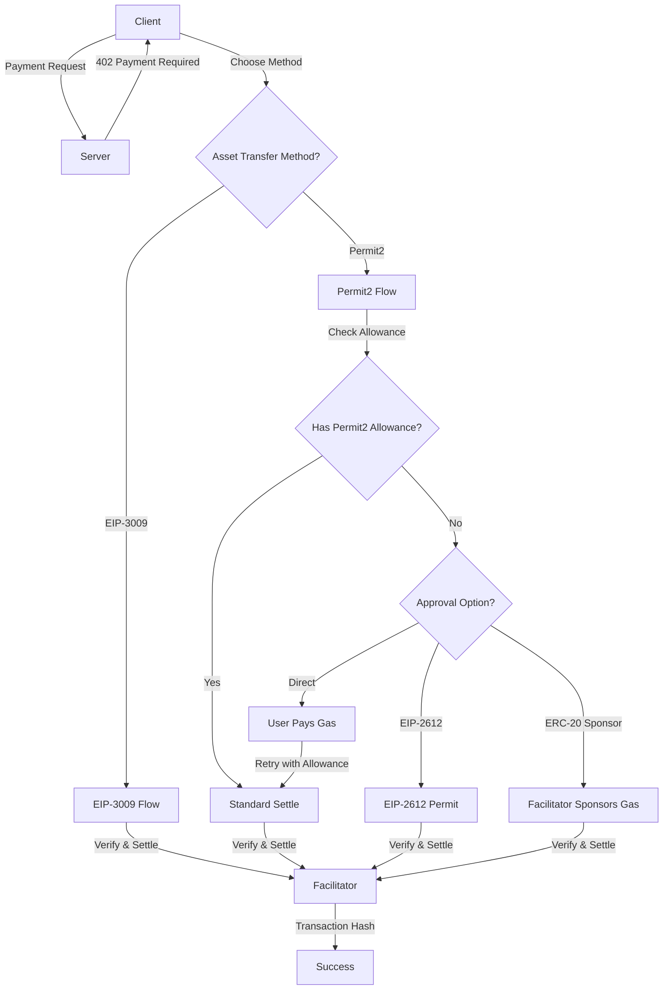

# Permit2 Implementation Plan for x402-rs (V2 Protocol Only)

## Executive Summary

This document outlines the implementation plan for adding **Permit2** support to the x402-rs EVM exact scheme **for the V2 protocol only**. The implementation will support three asset transfer methods:

1. **EIP-3009** (already implemented) - Native `transferWithAuthorization` for tokens like USDC
2. **Permit2 Standard** (new, V2 only) - Universal fallback using Uniswap's Permit2 contract
3. **Permit2 with Extensions** (new, V2 only) - Gasless approval flows via EIP-2612 or ERC-20 gas sponsoring

## Background

### Current State

The x402-rs project currently implements:
- ✅ EIP-3009 asset transfer method for V1 and V2 protocols
- ✅ EIP-155 chain support with ERC-3009 compliant tokens
- ✅ Protocol compliance test harness with 8 passing test combinations

**Important:** Permit2 support is being added **exclusively to the V2 protocol**. V1 will continue to support only EIP-3009.

### Specification Overview

According to [`docs/specs/schemes/exact/scheme_exact_evm.md`](../docs/specs/schemes/exact/scheme_exact_evm.md):

**Asset Transfer Methods:**
- **EIP-3009**: Direct `transferWithAuthorization` on tokens with native support
- **Permit2**: Universal proxy using Uniswap's canonical Permit2 contract with witness pattern

**Permit2 Approval Options:**
- **Option A**: Direct user approval (standard, requires gas)
- **Option B**: ERC-20 approval gas sponsoring (extension: `erc20ApprovalGasSponsoring`)
- **Option C**: EIP-2612 permit (extension: `eip2612GasSponsoring`)

## Architecture Overview



## Implementation Plan

### Phase 1: Core Permit2 Infrastructure (V2 Only)

#### 1.1 Smart Contract Integration

**Files to create:**
- `crates/chains/x402-chain-eip155/abi/IPermit2.json`
- `crates/chains/x402-chain-eip155/abi/x402Permit2Proxy.json`
- `crates/chains/x402-chain-eip155/abi/IERC20Permit.json`

**Tasks:**
- [ ] Add Permit2 ABI from Uniswap canonical deployment
- [ ] Add x402Permit2Proxy contract ABI (from spec reference implementation)
- [ ] Add IERC20Permit ABI for EIP-2612 support
- [ ] Generate Rust bindings using `alloy-sol-types`

**Contract Addresses:**
- Permit2 canonical address: Documented at https://docs.uniswap.org/contracts/v4/deployments
- x402Permit2Proxy: To be deployed using CREATE2 for deterministic addresses

#### 1.2 Type Definitions

**File:** `crates/chains/x402-chain-eip155/src/v2_eip155_exact/types.rs`

**New types to add (V2 only):**

```rust
/// Asset transfer method discriminator
#[derive(Debug, Clone, Serialize, Deserialize, PartialEq, Eq)]
#[serde(rename_all = "camelCase")]
pub enum AssetTransferMethod {
    #[serde(rename = "eip3009")]
    Eip3009,
    #[serde(rename = "permit2")]
    Permit2,
}

/// Enhanced payload supporting both EIP-3009 and Permit2
#[derive(Debug, Clone, Serialize, Deserialize)]
#[serde(tag = "assetTransferMethod", rename_all = "camelCase")]
pub enum ExactEvmPayload {
    #[serde(rename = "eip3009")]
    Eip3009(Eip3009Payload),
    #[serde(rename = "permit2")]
    Permit2(Permit2Payload),
}

/// EIP-3009 specific payload (existing structure)
#[derive(Debug, Clone, Serialize, Deserialize)]
#[serde(rename_all = "camelCase")]
pub struct Eip3009Payload {
    pub signature: Bytes,
    pub authorization: ExactEvmPayloadAuthorization,
}

/// Permit2 specific payload
#[derive(Debug, Clone, Serialize, Deserialize)]
#[serde(rename_all = "camelCase")]
pub struct Permit2Payload {
    pub signature: Bytes,
    pub permit2_authorization: Permit2Authorization,
}

/// Permit2 authorization structure
#[derive(Debug, Clone, Serialize, Deserialize)]
#[serde(rename_all = "camelCase")]
pub struct Permit2Authorization {
    pub permitted: PermittedToken,
    pub from: Address,
    pub spender: Address,  // x402Permit2Proxy address
    pub nonce: B256,
    pub deadline: UnixTimestamp,
    pub witness: Permit2Witness,
}

#[derive(Debug, Clone, Serialize, Deserialize)]
#[serde(rename_all = "camelCase")]
pub struct PermittedToken {
    pub token: Address,
    pub amount: U256,
}

#[derive(Debug, Clone, Serialize, Deserialize)]
#[serde(rename_all = "camelCase")]
pub struct Permit2Witness {
    pub to: Address,
    pub valid_after: UnixTimestamp,
    pub extra: serde_json::Value,  // Extensible for future use
}

/// Enhanced PaymentRequirementsExtra with asset transfer method
#[derive(Clone, Debug, Eq, PartialEq, Serialize, Deserialize)]
#[serde(rename_all = "camelCase")]
pub struct PaymentRequirementsExtra {
    pub name: String,
    pub version: String,
    #[serde(skip_serializing_if = "Option::is_none")]
    pub asset_transfer_method: Option<AssetTransferMethod>,
}
```

#### 1.3 Solidity Type Definitions

**File:** `crates/chains/x402-chain-eip155/src/v2_eip155_exact/types.rs` (V2 only)

Add Solidity-compatible structs for EIP-712 signing:

```rust
sol!(
    /// Permit2 PermitTransferFrom structure
    #[derive(Serialize, Deserialize)]
    struct PermitTransferFrom {
        TokenPermissions permitted;
        address spender;
        uint256 nonce;
        uint256 deadline;
    }

    #[derive(Serialize, Deserialize)]
    struct TokenPermissions {
        address token;
        uint256 amount;
    }

    /// x402 Witness structure
    #[derive(Serialize, Deserialize)]
    struct Witness {
        address to;
        uint256 validAfter;
        bytes extra;
    }
);
```

### Phase 2: Extension Support (V2 Only)

#### 2.1 Extension Type Definitions

**File:** `crates/x402-types/src/proto/extensions.rs` (new)

```rust
/// EIP-2612 gas sponsoring extension data
#[derive(Debug, Clone, Serialize, Deserialize)]
#[serde(rename_all = "camelCase")]
pub struct Eip2612GasSponsoringExtension {
    pub from: Address,
    pub asset: Address,
    pub spender: Address,  // Canonical Permit2
    pub amount: U256,
    pub nonce: U256,
    pub deadline: UnixTimestamp,
    pub signature: Bytes,
    pub version: String,
}

/// ERC-20 approval gas sponsoring extension data
#[derive(Debug, Clone, Serialize, Deserialize)]
#[serde(rename_all = "camelCase")]
pub struct Erc20ApprovalGasSponsoringExtension {
    pub from: Address,
    pub asset: Address,
    pub spender: Address,  // Canonical Permit2
    pub amount: U256,
    pub signed_transaction: Bytes,  // RLP-encoded signed tx
    pub version: String,
}

/// Extension container in PaymentPayload
#[derive(Debug, Clone, Serialize, Deserialize, Default)]
#[serde(rename_all = "camelCase")]
pub struct PaymentExtensions {
    #[serde(skip_serializing_if = "Option::is_none")]
    pub eip2612_gas_sponsoring: Option<Eip2612GasSponsoringExtension>,
    
    #[serde(skip_serializing_if = "Option::is_none")]
    pub erc20_approval_gas_sponsoring: Option<Erc20ApprovalGasSponsoringExtension>,
}
```

#### 2.2 Extension Schema Definitions

**File:** `crates/x402-types/src/proto/extensions.rs` (new)

- Define JSON schemas for extension validation
- Implement schema validation logic
- Add extension registry for facilitator capabilities

### Phase 3: Client Implementation (V2 Only)

#### 3.1 Permit2 Client Logic

**File:** `crates/chains/x402-chain-eip155/src/v2_eip155_exact/client.rs`

**New functions:**

```rust
/// Generate Permit2 payment signature
pub async fn create_permit2_payment<S: Signer>(
    signer: &S,
    requirements: &PaymentRequirements,
    nonce: B256,
    deadline: UnixTimestamp,
    valid_after: UnixTimestamp,
    proxy_address: Address,
) -> Result<Permit2Payload, ClientError>;

/// Check if user has Permit2 allowance
pub async fn check_permit2_allowance<P: Provider>(
    provider: &P,
    token: Address,
    owner: Address,
    permit2_address: Address,
) -> Result<U256, ClientError>;

/// Generate EIP-2612 permit signature
pub async fn create_eip2612_permit<S: Signer>(
    signer: &S,
    token: Address,
    spender: Address,  // Permit2 address
    amount: U256,
    deadline: UnixTimestamp,
    domain: &Eip712Domain,
) -> Result<Eip2612GasSponsoringExtension, ClientError>;

/// Generate signed ERC-20 approval transaction
pub async fn create_erc20_approval_tx<S: Signer>(
    signer: &S,
    token: Address,
    spender: Address,  // Permit2 address
    amount: U256,
    nonce: u64,
    gas_price: u128,
) -> Result<Erc20ApprovalGasSponsoringExtension, ClientError>;
```

**Client decision flow:**

1. Check if token supports EIP-3009 → use EIP-3009 flow
2. Otherwise, use Permit2:
   - Check Permit2 allowance
   - If insufficient:
     - Check if token supports EIP-2612 → use EIP-2612 extension
     - Otherwise, check if facilitator supports ERC-20 gas sponsoring
     - Otherwise, return error requiring user approval
   - Generate Permit2 signature with witness

### Phase 4: Server Implementation (V2 Only)

#### 4.1 Server Payment Requirements

**File:** `crates/chains/x402-chain-eip155/src/v2_eip155_exact/server.rs`

**Updates:**

```rust
/// Generate payment requirements with Permit2 support
pub fn create_payment_requirements(
    scheme: ExactScheme,
    network: String,
    amount: U256,
    asset: Address,
    pay_to: Address,
    max_timeout_seconds: u64,
    asset_transfer_method: Option<AssetTransferMethod>,
    name: String,
    version: String,
) -> PaymentRequirements;

/// Advertise extension support in 402 response
pub fn create_payment_required_with_extensions(
    requirements: PaymentRequirements,
    supports_eip2612: bool,
    supports_erc20_sponsoring: bool,
) -> PaymentRequiredResponse;
```

**Extension advertisement:**
- Include `extensions` object in 402 response
- Specify supported extensions with schemas
- Document facilitator capabilities

### Phase 5: Facilitator Implementation (V2 Only)

#### 5.1 Permit2 Verification Logic

**File:** `crates/chains/x402-chain-eip155/src/v2_eip155_exact/facilitator.rs`

**New functions:**

```rust
/// Verify Permit2 payment signature
async fn verify_permit2_payment<P: Provider>(
    provider: &P,
    proxy: &x402Permit2Proxy::x402Permit2ProxyInstance<P>,
    payment: &Permit2Payment,
    domain: &Eip712Domain,
) -> Result<Address, Eip155ExactError>;

/// Check Permit2 allowance and handle extensions
async fn check_permit2_allowance_with_extensions<P: Provider>(
    provider: &P,
    token: Address,
    owner: Address,
    permit2_address: Address,
    required_amount: U256,
    extensions: &PaymentExtensions,
) -> Result<AllowanceStatus, Eip155ExactError>;

/// Verify EIP-2612 permit extension
async fn verify_eip2612_extension<P: Provider>(
    provider: &P,
    token: Address,
    extension: &Eip2612GasSponsoringExtension,
) -> Result<(), Eip155ExactError>;

/// Verify ERC-20 approval gas sponsoring extension
async fn verify_erc20_approval_extension<P: Provider>(
    provider: &P,
    extension: &Erc20ApprovalGasSponsoringExtension,
) -> Result<(), Eip155ExactError>;

/// Simulate Permit2 settlement
async fn simulate_permit2_settlement<P: Provider>(
    provider: &P,
    proxy: &x402Permit2Proxy::x402Permit2ProxyInstance<P>,
    payment: &Permit2Payment,
    extensions: &PaymentExtensions,
) -> Result<(), Eip155ExactError>;
```

**Verification flow:**

1. Determine asset transfer method from payload
2. If Permit2:
   - Verify signature recovers to `from` address
   - Verify witness data matches requirements
   - Check Permit2 allowance
   - If insufficient allowance:
     - Check for EIP-2612 extension → verify permit signature
     - Check for ERC-20 approval extension → verify signed transaction
     - If neither → return 412 Precondition Failed
   - Verify sufficient token balance
   - Simulate settlement transaction

#### 5.2 Permit2 Settlement Logic

**File:** `crates/chains/x402-chain-eip155/src/v2_eip155_exact/facilitator.rs`

**New functions:**

```rust
/// Settle Permit2 payment
async fn settle_permit2_payment<P: Eip155MetaTransactionProvider>(
    provider: &P,
    proxy: &x402Permit2Proxy::x402Permit2ProxyInstance<P::Inner>,
    payment: &Permit2Payment,
    extensions: &PaymentExtensions,
) -> Result<B256, Eip155ExactError>;

/// Settle with EIP-2612 permit
async fn settle_with_eip2612<P: Eip155MetaTransactionProvider>(
    provider: &P,
    proxy: &x402Permit2Proxy::x402Permit2ProxyInstance<P::Inner>,
    payment: &Permit2Payment,
    permit: &Eip2612GasSponsoringExtension,
) -> Result<B256, Eip155ExactError>;

/// Settle with ERC-20 approval gas sponsoring
async fn settle_with_erc20_approval<P: Eip155MetaTransactionProvider>(
    provider: &P,
    proxy: &x402Permit2Proxy::x402Permit2ProxyInstance<P::Inner>,
    payment: &Permit2Payment,
    approval: &Erc20ApprovalGasSponsoringExtension,
) -> Result<B256, Eip155ExactError>;
```

**Settlement flow:**

1. Standard Permit2:
   - Call `proxy.settle(permit, amount, owner, witness, signature)`
   
2. With EIP-2612 extension:
   - Call `proxy.settleWith2612(permit2612, amount, permit, owner, witness, signature)`
   
3. With ERC-20 approval extension:
   - Construct atomic batch transaction:
     - Check if user needs gas funding
     - If yes: transfer native gas to user
     - Broadcast user's signed approval transaction
     - Call `proxy.settle(...)`

**Key implementation notes:**
- Extend existing `assert_valid_payment` to handle both EIP-3009 and Permit2 payloads
- Route to appropriate verification logic based on asset transfer method
- Handle extensions in verification and settlement
- **V2 protocol only** - no changes to V1 facilitator

### Phase 6: Configuration and Deployment (V2 Only)

#### 6.1 Facilitator Configuration

**File:** `facilitator/src/config.rs`

**New configuration options:**

```rust
#[derive(Debug, Clone, Serialize, Deserialize)]
pub struct Eip155ChainConfig {
    // ... existing fields ...
    
    /// Canonical Permit2 contract address
    #[serde(skip_serializing_if = "Option::is_none")]
    pub permit2_address: Option<Address>,
    
    /// x402Permit2Proxy contract address
    #[serde(skip_serializing_if = "Option::is_none")]
    pub x402_permit2_proxy_address: Option<Address>,
    
    /// Enable EIP-2612 gas sponsoring extension
    #[serde(default)]
    pub enable_eip2612_gas_sponsoring: bool,
    
    /// Enable ERC-20 approval gas sponsoring extension
    #[serde(default)]
    pub enable_erc20_approval_gas_sponsoring: bool,
}
```

**Example configuration:**

```json
{
  "chains": {
    "eip155:84532": {
      "rpc_url": "https://sepolia.base.org",
      "permit2_address": "0x000000000022D473030F116dDEE9F6B43aC78BA3",
      "x402_permit2_proxy_address": "0x...",
      "enable_eip2612_gas_sponsoring": true,
      "enable_erc20_approval_gas_sponsoring": true
    }
  }
}
```

#### 6.2 Contract Deployment (V2 Only)

**Tasks:**
- [ ] Deploy x402Permit2Proxy using CREATE2 for deterministic addresses
- [ ] Verify deployment on all supported chains
- [ ] Document deployed addresses
- [ ] Update configuration examples

### Phase 7: Testing (V2 Only)

#### 7.1 Unit Tests

**Files to create:**
- `crates/chains/x402-chain-eip155/src/v2_eip155_exact/tests/permit2.rs`

**Test coverage:**

```rust
#[cfg(test)]
mod tests {
    // Type serialization tests
    #[test]
    fn test_permit2_payload_serialization();
    
    #[test]
    fn test_permit2_authorization_serialization();
    
    #[test]
    fn test_extension_serialization();
    
    // EIP-712 signing tests
    #[test]
    fn test_permit2_signature_generation();
    
    #[test]
    fn test_eip2612_permit_signature();
    
    // Verification tests
    #[test]
    fn test_permit2_signature_verification();
    
    #[test]
    fn test_witness_validation();
    
    #[test]
    fn test_allowance_check();
    
    // Extension tests
    #[test]
    fn test_eip2612_extension_verification();
    
    #[test]
    fn test_erc20_approval_extension_verification();
}
```

#### 7.2 Integration Tests

**Protocol compliance test matrix additions (V2 only):**

| #  | Test Name                          | Client     | Server     | Facilitator | Chain  | Method  | Extension | Status |
|----|------------------------------------|------------|------------|-------------|--------|---------|-----------|--------|
| 9  | v2-eip155-permit2-rs-rs-rs         | Rust       | Rust       | Rust        | eip155 | permit2 | none      | ⏳      |
| 10 | v2-eip155-permit2-ts-rs-rs         | TypeScript | Rust       | Rust        | eip155 | permit2 | none      | ⏳      |
| 11 | v2-eip155-permit2-ts-ts-rs         | TypeScript | TypeScript | Rust        | eip155 | permit2 | none      | ⏳      |
| 12 | v2-eip155-permit2-rs-ts-rs         | Rust       | TypeScript | Rust        | eip155 | permit2 | none      | ⏳      |
| 13 | v2-eip155-permit2-rs-rs-rs.eip2612 | Rust       | Rust       | Rust        | eip155 | permit2 | eip2612   | ⏳      |
| 14 | v2-eip155-permit2-ts-rs-rs.eip2612 | TypeScript | Rust       | Rust        | eip155 | permit2 | eip2612   | ⏳      |
| 15 | v2-eip155-permit2-rs-rs-rs.erc20   | Rust       | Rust       | Rust        | eip155 | permit2 | erc20     | ⏳      |
| 16 | v2-eip155-permit2-ts-rs-rs.erc20   | TypeScript | Rust       | Rust        | eip155 | permit2 | erc20     | ⏳      |

**Test files to create (V2 only):**

```
protocol-compliance/src/tests/
├── v2-eip155-permit2-rs-rs-rs.test.ts
├── v2-eip155-permit2-ts-rs-rs.test.ts
├── v2-eip155-permit2-ts-ts-rs.test.ts
├── v2-eip155-permit2-rs-ts-rs.test.ts
├── v2-eip155-permit2-rs-rs-rs.eip2612.test.ts
├── v2-eip155-permit2-ts-rs-rs.eip2612.test.ts
├── v2-eip155-permit2-rs-rs-rs.erc20.test.ts
└── v2-eip155-permit2-ts-rs-rs.erc20.test.ts
```

**Test scenarios (V2 only):**

1. **Standard Permit2 flow:**
   - User has existing Permit2 allowance
   - Payment succeeds with Permit2 signature

2. **EIP-2612 extension flow:**
   - User has no Permit2 allowance
   - Token supports EIP-2612
   - Facilitator accepts EIP-2612 permit
   - Payment succeeds with combined signatures

3. **ERC-20 approval gas sponsoring flow:**
   - User has no Permit2 allowance
   - Token does not support EIP-2612
   - Facilitator sponsors approval transaction
   - Payment succeeds with atomic batch

4. **Precondition failed flow:**
   - User has no Permit2 allowance
   - No extension provided
   - Facilitator returns 412 with error code

5. **Mixed method support (V2 only):**
   - Server advertises both EIP-3009 and Permit2
   - Client chooses appropriate method based on token

#### 7.3 Test Utilities

**File:** `protocol-compliance/src/utils/permit2.ts`

```typescript
export interface Permit2Config {
  permit2Address: string;
  proxyAddress: string;
}

export async function setupPermit2Test(
  token: string,
  owner: string,
  amount: string
): Promise<Permit2Config>;

export async function grantPermit2Allowance(
  token: string,
  owner: string,
  permit2: string,
  amount: string
): Promise<void>;

export async function checkPermit2Allowance(
  token: string,
  owner: string,
  permit2: string
): Promise<bigint>;
```

### Phase 8: Documentation (V2 Only)

#### 8.1 Code Documentation

**Files to update:**
- `crates/chains/x402-chain-eip155/README.md`
- `crates/chains/x402-chain-eip155/src/lib.rs` (module docs)

**Documentation sections (V2 focus):**

1. **Permit2 Overview**
   - What is Permit2
   - Why use Permit2
   - Comparison with EIP-3009
   - V2 protocol only

2. **Usage Examples**
   - Client: Creating Permit2 payments (V2)
   - Server: Advertising Permit2 support (V2)
   - Facilitator: Verifying and settling Permit2 payments (V2)

3. **Extension Guide**
   - EIP-2612 gas sponsoring (V2)
   - ERC-20 approval gas sponsoring (V2)
   - When to use each extension (V2)

4. **Configuration Guide**
   - Permit2 contract addresses (V2)
   - Extension enablement (V2)
   - Security considerations (V2)

#### 8.2 Protocol Compliance Documentation

**File:** `protocol-compliance/README.md`

**Updates:**
- Add Permit2 test combinations to test matrix (V2 only)
- Document extension testing approach (V2)
- Update naming convention for extension tests (V2)

#### 8.3 User Guides

**Files to create:**
- `docs/guides/permit2-integration.md` (V2 focus)
- `docs/guides/gasless-approvals.md` (V2 focus)

**Content:**
- Step-by-step integration guide (V2)
- Common pitfalls and solutions (V2)
- Performance considerations (V2)
- Security best practices (V2)

## Implementation Phases Summary (V2 Only)

### Phase 1: Core Infrastructure (Week 1-2) - V2 Only
- Smart contract ABIs and bindings
- Type definitions for Permit2 in V2 module
- Basic Solidity type support

### Phase 2: Extensions (Week 2-3) - V2 Only
- Extension type definitions
- Schema validation
- Extension registry

### Phase 3: Client (Week 3-4) - V2 Only
- Permit2 signature generation in V2 client
- Allowance checking
- Extension support

### Phase 4: Server (Week 4) - V2 Only
- Payment requirements with Permit2 in V2 server
- Extension advertisement
- V2 protocol-specific implementation

### Phase 5: Facilitator (Week 5-6) - V2 Only
- Permit2 verification logic in V2 facilitator
- Extension verification
- Settlement with extensions
- Atomic batch transactions

### Phase 6: Configuration (Week 6) - V2 Only
- Configuration schema updates
- Contract deployment
- Address documentation

### Phase 7: Testing (Week 7-8) - V2 Only
- Unit tests for V2 Permit2
- Integration tests
- Protocol compliance tests (V2 only)
- Test utilities

### Phase 8: Documentation (Week 8) - V2 Only
- Code documentation
- User guides
- Protocol compliance updates
- Clear V2-only designation

## Dependencies and Prerequisites (V2 Focus)

### External Dependencies

1. **Permit2 Contract:**
   - Canonical Uniswap Permit2 deployment
   - Address: https://docs.uniswap.org/contracts/v4/deployments

2. **x402Permit2Proxy Contract:**
   - Deploy using CREATE2 for deterministic addresses
   - Source: Spec reference implementation

3. **Test Tokens (V2 testing):**
   - ERC-20 tokens with EIP-2612 support (e.g., USDC on testnet)
   - ERC-20 tokens without EIP-2612 support
   - Sufficient testnet funds for gas sponsoring tests

### Internal Dependencies

1. **Alloy Updates:**
   - Ensure alloy-sol-types supports Permit2 structs
   - Verify EIP-712 domain construction

2. **Provider Enhancements:**
   - Atomic batch transaction support
   - Gas estimation for complex transactions

3. **Type System (V2):**
   - Extension support in V2 proto types
   - Flexible payload structure for V2

## Risk Assessment

### Technical Risks

| Risk                                        | Impact | Mitigation                                            |
|---------------------------------------------|--------|-------------------------------------------------------|
| Permit2 contract not deployed on all chains | High   | Document supported chains, provide deployment scripts |
| EIP-712 signature incompatibility           | High   | Extensive testing against canonical implementation    |
| Atomic batch transaction failures           | Medium | Robust simulation and error handling                  |
| Gas estimation errors                       | Medium | Conservative gas limits, fallback strategies          |
| Extension schema validation complexity      | Low    | Clear schema definitions, comprehensive tests         |

### Security Risks

| Risk                            | Impact | Mitigation                                  |
|---------------------------------|--------|---------------------------------------------|
| Signature replay attacks        | High   | Nonce validation, deadline enforcement      |
| Witness data manipulation       | High   | Strict witness validation in proxy contract |
| Front-running in gas sponsoring | Medium | Atomic batch transactions, MEV protection   |
| Allowance griefing              | Low    | Clear error messages, user education        |

## Success Criteria (V2 Focus)

### Functional Requirements

- ✅ Support all three Permit2 approval options (V2 only)
- ✅ Maintain backward compatibility with EIP-3009 (both V1 and V2)
- ✅ Pass all protocol compliance tests
- ✅ V2 protocol support for Permit2
- ✅ V1 protocol continues with EIP-3009 only

### Non-Functional Requirements

- ✅ Performance: Settlement within 30 seconds
- ✅ Reliability: 99.9% success rate for valid payments
- ✅ Security: No critical vulnerabilities
- ✅ Documentation: Complete API and user guides (V2)

### Test Coverage

- ✅ Unit test coverage > 80%
- ✅ Integration test coverage for all V2 combinations
- ✅ Protocol compliance tests passing (V2)
- ✅ Extension tests for both EIP-2612 and ERC-20 sponsoring (V2)

## Open Questions

1. **Contract Deployment:**
   - Who will deploy x402Permit2Proxy contracts? (V2)
   - What is the deployment timeline? (V2)
   - How to handle chain-specific variations? (V2)

2. **Gas Sponsoring Limits:**
   - Should facilitators set limits on gas sponsoring amounts? (V2)
   - How to prevent abuse of gas sponsoring? (V2)
   - What are reasonable gas price limits? (V2)

3. **Extension Priority (V2):**
   - If both extensions are available, which should client prefer? (V2)
   - Should server advertise preference order? (V2)
   - How to handle extension conflicts? (V2)

4. **Protocol Version Clarity:**
   - How to clearly communicate V2-only Permit2 support?
   - Should V2 servers support both EIP-3009 and Permit2?
   - What is the client upgrade path from V1 to V2?

5. **Testing Infrastructure (V2):**
   - Do we need dedicated testnet deployments? (V2)
   - How to handle testnet token availability? (V2)
   - What is the CI/CD strategy for integration tests? (V2)

## Next Steps

1. **Immediate Actions:**
   - [ ] Review and approve this implementation plan
   - [ ] Obtain Permit2 contract addresses for supported chains
   - [ ] Set up testnet environment with required tokens
   - [ ] Create GitHub issues for each phase

2. **Week 1 Kickoff:**
   - [ ] Begin Phase 1: Core Infrastructure (V2)
   - [ ] Set up development environment
   - [ ] Create feature branch
   - [ ] Initial ABI integration

3. **Stakeholder Communication:**
   - [ ] Share plan with team
   - [ ] Gather feedback on priorities
   - [ ] Align on timeline and resources
   - [ ] Schedule regular check-ins

## References

- [EVM Exact Scheme Specification](../docs/specs/schemes/exact/scheme_exact_evm.md)
- [EIP-2612 Gas Sponsoring Extension](../docs/specs/extensions/eip2612_gas_sponsoring.md)
- [ERC-20 Approval Gas Sponsoring Extension](../docs/specs/extensions/erc20_gas_sponsoring.md)
- [Protocol Compliance Test Harness](../protocol-compliance/README.md)
- [Uniswap Permit2 Documentation](https://docs.uniswap.org/contracts/permit2/overview)
- [EIP-2612: Permit Extension for ERC-20](https://eips.ethereum.org/EIPS/eip-2612)
- [EIP-3009: Transfer With Authorization](https://eips.ethereum.org/EIPS/eip-3009)
