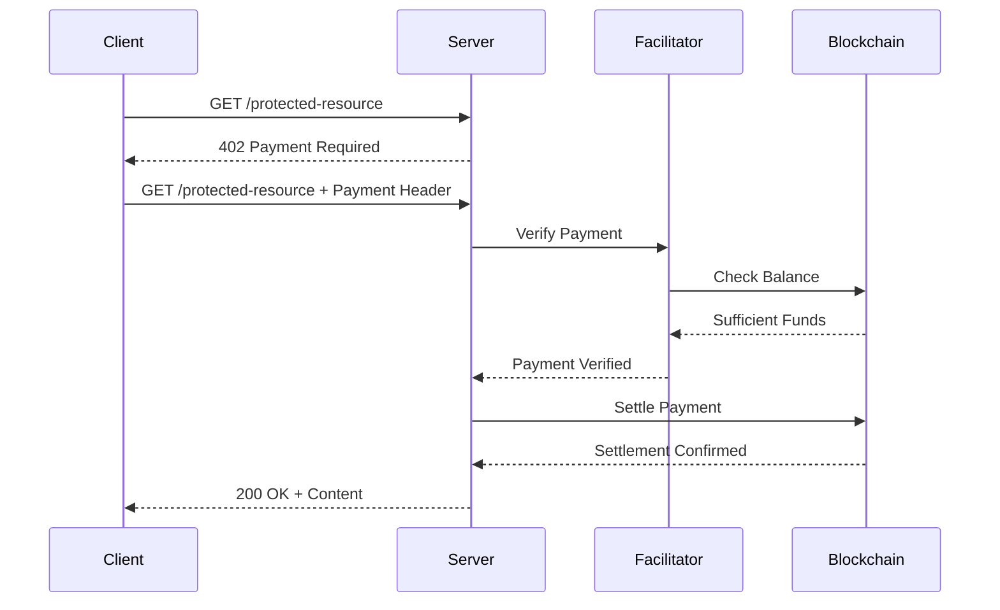

# x402-rs Protocol Compliance Test Harness Plan

## Overview

This document outlines the plan for creating a comprehensive protocol compliance test harness for the x402-rs project. The harness will test various combinations of client, server, and facilitator implementations across multiple chains and protocol versions.

## Current State Analysis

### Existing Implementations

| Component | Rust Crate | TypeScript Package | Status |
|-----------|------------|-------------------|--------|
| **Client** | `x402-reqwest` | `@x402/fetch` | V1, V2 for EVM, Solana, Aptos |
| **Server** | `x402-axum` | `@x402/hono` | V1, V2 middleware |
| **Facilitator** | `x402-facilitator-local` | `@x402/core` | Full implementation |

### Existing TypeScript Tester (`x402-ts-tester`)

The [`x402-ts-tester`](file:///Users/ukstv/Developer/FareSide/x402-ts-tester) provides reference implementations:
- `v1-seller.ts` / `v2-seller.ts` - Server implementations using Hono
- `v1-buyer-evm.ts` / `v2-buyer-evm.ts` - Client implementations
- Manual execution, no automation

## Test Matrix

The test harness supports these axes of configuration (not all combinations are valid):

| x402 Version | Client | Server | Facilitator | Namespace | Scheme | Extension |
|--------------|--------|--------|-------------|-----------|--------|----------|
| v1 | Rust (rs) | Rust (rs) | Local (rs) | eip155 | exact | (none) |
| v2 | TS (ts) | TS (ts) | TS (@x402) | solana | | eip2612GasSponsoring (eip155 + exact) |
| | | | Remote | aptos | | erc20ApprovalGasSponsoring (eip155 + exact) |
| | | | | | | sign-in-with-x |
| | | | | | | bazaar (v2 only) |

**Naming Convention:** `{x402-version}-{namespace}-{scheme}-{client}-{server}-{facilitator}.{modifier}.test.ts`

Example: `v2-eip155-exact-rs-rs-rs.test.ts` (x402 v2, eip155, exact, Rust Client + Rust Server + Rust Facilitator)
Example: `v2-solana-exact-rs-rs-rs.siwx.test.ts` (with sign-in-with-x modifier)

**Initial Focus Combinations:**
1. v2-eip155-exact-rs-rs-rs (Rust Client + Rust Server + Rust Facilitator + eip155)
2. v2-solana-exact-rs-rs-rs (Rust Client + Rust Server + Rust Facilitator + Solana)
3. v2-eip155-exact-ts-ts-rs (TS Client + TS Server + Rust Facilitator + eip155)
4. v2-eip155-exact-ts-rs-rs (TS Client + Rust Server + Rust Facilitator + eip155)
5. v2-eip155-exact-rs-ts-rs (Rust Client + TS Server + Rust Facilitator + eip155)

> **Note:** Combination 3 (TS Client + TS Server + Rust Facilitator) is critical for testing the Rust facilitator's compatibility with the canonical TypeScript implementation, isolating any quirks in the Rust facilitator.

## Proposed Structure

```
protocol-compliance/
├── package.json                    # Node.js configuration
├── tsconfig.json                   # TypeScript configuration
├── .env.example                    # Environment template
├── .env                            # Local environment (gitignored)
├── justfile                       # Task runner commands
├── README.md                       # Documentation
├── src/
│   ├── index.ts                   # Main entry point (all tests)
│   ├── cli.ts                      # CLI for manual test invocation
│   ├── utils/
│   │   ├── facilitator.ts         # Facilitator utilities
│   │   ├── server.ts              # Server utilities (startRustServer, startTSServer)
│   │   ├── client.ts               # Client utilities (startRustClient, startTSClient)
│   │   ├── config.ts              # Configuration management
│   │   └── waitFor.ts              # Polling utilities
│   ├── tests/
│   │   ├── v2-eip155-exact-rs-rs-rs.test.ts
│   │   ├── v2-solana-exact-rs-rs-rs.test.ts
│   │   ├── v2-eip155-exact-ts-ts-rs.test._ts    # TS Client + TS Server + Rust Facilitator
│   │   ├── v2-eip155-exact-ts-rs-rs.test._ts
│   │   ├── v2-eip155-exact-rs-ts-rs.test._ts
│   │   ├── v1-eip155-exact-rs-rs-rs.test.ts        # Rust client + Rust server
│   │   ├── v1-eip155-exact-rs-ts-rs.test.ts        # Rust client + TS server
│   │   ├── v1-eip155-exact-ts-rs-rs.test.ts        # TS client + Rust server
│   │   ├── v1-eip155-exact-ts-ts-rs.test.ts        # TS client + TS server
│   │   ├── v1-solana-exact-rs-rs-rs.test.ts        # Rust client + Rust server
│   │   ├── v1-solana-exact-rs-ts-rs.test.ts        # Rust client + TS server
│   │   ├── v1-solana-exact-ts-rs-rs.test.ts        # TS client + Rust server
│   │   └── v1-solana-exact-ts-ts-rs.test.ts        # TS client + TS server
│   ├── fixtures/
│   │   └── keys.ts               # Test wallets (from env)
│   └── types/
│       └── index.ts               # TypeScript types
```

## Key Components

### 1. Configuration Management ([`protocol-compliance/src/utils/config.ts`])

```typescript
interface TestConfig {
  facilitator: {
    local: { port: number };
    remote: { url: string };
  };
  server: {
    rust: { port: number; facilitatorUrl: string };
    ts: { port: number; facilitatorUrl: string };
  };
  client: {
    rust: { facilitatorUrl: string };
    ts: { facilitatorUrl: string };
  };
  chains: {
    eip155: { network: string; rpcUrl: string };
    solana: { network: string; rpcUrl: string };
    aptos: { network: string; rpcUrl: string };
  };
  wallets: {
    payer: { eip155: string; solana: string; aptos: string };
    payee: { eip155: string; solana: string; aptos: string };
  };
}
```

### 2. Server Utilities ([`protocol-compliance/src/utils/server.ts`])

```typescript
interface ServerHandle {
  url: string;
  stop: () => Promise<void>;
}

async function startRustServer(port: number, facilitatorUrl: string): Promise<ServerHandle>;
async function startTSServer(port: number, facilitatorUrl: string): Promise<ServerHandle>;
```

### 3. Client Utilities ([`protocol-compliance/src/utils/client.ts`])

```typescript
interface ClientHandle {
  url: string;
  stop: () => Promise<void>;
}

async function startRustClient(port: number, facilitatorUrl: string): Promise<ClientHandle>;
async function startTSClient(port: number, facilitatorUrl: string): Promise<ClientHandle>;
```

### 4. Facilitator Management ([`protocol-compliance/src/utils/facilitator.ts`])

```typescript
// Uses the same ServerHandle interface as above
async function startLocalFacilitator(port: number, configPath: string): Promise<ServerHandle>;
async function waitForFacilitator(url: string, maxWaitMs: number): Promise<boolean>;
async function getSupportedChains(url: string): Promise<string[]>;
```

**Note:** The local facilitator is run via `cargo run --package facilitator` with the config from [`facilitator/config.json`](facilitator/config.json).

### 5. Test Framework

Uses **Vitest** for test execution with the following patterns:

```typescript
import { describe, it, expect, beforeAll, afterAll } from 'vitest';

describe('v2-eip155-exact-rs-rs-rs: x402 v2, eip155, exact, Rust Client + Rust Server + Rust Facilitator', () => {
  let facilitator: ServerHandle;
  let server: ServerHandle;
  let client: ClientHandle;

  beforeAll(async () => {
    facilitator = await startLocalFacilitator(23635, 'facilitator/config.json');
    server = await startRustServer(3000, facilitator.url);
    client = await startRustClient(3001, facilitator.url);
  });

  afterAll(async () => {
    await client.stop();
    await server.stop();
    await facilitator.stop();
  });

  it('should complete payment flow', async () => {
    const response = await fetch(`${server.url}/protected-resource`, {
      headers: {
        'X-Payment-Accepted': '2',
        'X-Payment-Scheme': 'exact',
        'X-Payment-Namespace': 'eip155',
        'X-Payment-Payee': payeeAddress,
        'X-Payment-Amount': '1',
      },
    });
    expect(response.status).toBe(200);
    const text = await response.text();
    expect(text).toBe('This is a VIP content!');
  });
});
```

## Command Interface

### All-in-One Test Execution

```bash
# Run all tests
just test-all

# Run specific test category
just test eip155           # eip155-only tests
just test solana           # Solana-only tests
just test compat           # Compatibility tests

# Run with verbose output
just test-all --verbose

# Generate coverage report
just test-coverage
```

### Manual Test Invocation

```bash
# Single combination test
protocol-compliance run --client rs --server rs --facilitator rs --chain eip155 --version v2

# Debug mode with logs
protocol-compliance run --client rs --server rs --chain eip155 --verbose --debug
```

### Facilitator Management

```bash
# Run local facilitator (uses config.json in facilitator folder)
cargo run --package facilitator -- --config facilitator/config.json
```

## Test Scenarios

### 1. Basic Payment Flow



### 2. Test Cases

| Test Case              | Description               | Expected Result |
|------------------------|--------------------------|-----------------|
| Happy Path             | Complete payment flow    | 200 OK + "This is a VIP content!" |

> **Note:** Error cases (missing payment, insufficient funds, invalid signature, etc.) are tested per-component, not in E2E harness.

## Implementation Tasks

### Phase 0: Infrastructure Setup ✅ DONE

- [x] Create `protocol-compliance/` directory structure
- [x] Set up `package.json` with dependencies
- [x] Configure TypeScript and Vitest
- [x] Create environment configuration template
- [x] Set up justfile commands
- [x] **Ensure it runs and works as expected**

### Phase 1: v2-eip155-exact-rs-rs-rs Scenario ✅ DONE

**Scenario:** Rust Client + Rust Server + Rust Facilitator + eip155 + exact

- [x] Implement `startLocalFacilitator()` utility
- [x] Implement `startRustServer()` utility
- [x] Write `v2-eip155-exact-rs-rs-rs.test.ts` with happy path test

> **Note:** Error cases are tested per-component, not in E2E harness.

### Phase 2: v2-eip155-exact-ts-rs-rs Scenario ✅ DONE

**Scenario:** TS Client + Rust Server + Rust Facilitator + eip155 + exact

- [x] Implement `createX402Client()` using @x402/fetch
- [x] Write `v2-eip155-exact-ts-rs-rs.test._ts` with happy path test

> **Note:** Error cases are tested per-component, not in E2E harness.

### Phase 2.5: Programmatic Server/Client Management (IN PROGRESS)

**Goal:** All servers and clients should be started programmatically via `beforeAll()` hooks.

- [x] Implement `startRustClient()` in `client.ts` to spawn x402-reqwest-example
- [x] Update Phase 1 test to spawn Rust client and verify response contains "This is a VIP content!"
- [ ] Update Phase 2 test to verify response contains "This is a VIP content!"
- [ ] Implement `startTSServer()` using @x402/hono
- [ ] Implement `startTSClient()` using @x402/fetch

### Phase 3: v2-eip155-exact-ts-ts-rs Scenario

**Scenario:** TS Client + TS Server + Rust Facilitator + eip155 + exact

- [ ] Write `v2-eip155-exact-ts-ts-rs.test._ts` with happy path test

### Phase 4: v2-eip155-exact-rs-ts-rs Scenario

**Scenario:** Rust Client + TS Server + Rust Facilitator + eip155 + exact

- [ ] Write `v2-eip155-exact-rs-ts-rs.test._ts` with happy path test

### Phase 5: v2-solana-exact-rs-rs-rs ✅ DONE

**Scenario:** Rust Client + Rust Server + Rust Facilitator + Solana + exact

- [x] Add Solana chain configuration to test-config.json
- [x] Write `v2-solana-exact-rs-rs-rs.test.ts` with happy path test

### Future Work (Out of Scope here)

Extensions are part of this repository but not yet implemented:
- eip2612GasSponsoring, erc20ApprovalGasSponsoring, sign-in-with-x, bazaar
- Tests will be added when extensions are implemented

#### Aptos Support (Future Work)

Aptos chain support requires additional setup and is planned for future phases:
- [ ] Add Aptos chain configuration to test-config.json
- [ ] Write `v2-aptos-exact-rs-rs-rs.test.ts` - Rust client + Rust server
- [ ] Write `v1-aptos-exact-rs-rs-rs.test.ts` - V1 Rust tests

### Phase 6: CLI and Integration

- [ ] Build CLI for manual test invocation
- [ ] Add `just` commands for all operations

## Environment Variables

```bash
# Required
EVM_PAYER_PRIVATE_KEY=0x...
EIP155_PAYEE_ADDRESS=0x...
SOLANA_PAYER_KEYPAIR=[...]
APTOS_PAYER_PRIVATE_KEY=...

# Optional (defaults provided)
FACILITATOR_PORT=23635
SERVER_PORT=3000
FACILITATOR_URL=http://localhost:23635

# Blockchain RPC URLs (optional, defaults to public RPCs)
EIP155_RPC_URL=https://...
SOLANA_RPC_URL=https://...
APTOS_RPC_URL=https://...
```

## Dependencies

```json
{
  "devDependencies": {
    "typescript": "^5.9.3",
    "vitest": "^2.1.8",
    "@types/node": "^22.10.2",
    "tsx": "^4.21.0"
  },
  "dependencies": {
    "@x402/fetch": "^2.2.0",
    "@x402/hono": "^2.2.0",
    "@x402/core": "^2.2.0",
    "@x402/evm": "^2.2.0",
    "@x402/svm": "^2.2.0",
    "hono": "^4.11.4",
    "viem": "^2.44.2",
    "@solana/kit": "^5.4.0",
    "dotenv": "^17.2.3"
  }
}
```

## Justfile Commands

```makefile
# Run all tests
test-all:
    cd protocol-compliance && pnpm test

# Run specific test file
test FILE='':
    cd protocol-compliance && pnpm vitest run {{FILE}}

# Run specific test by name pattern
test-pattern PATTERN='':
    cd protocol-compliance && pnpm vitest run -t {{PATTERN}}

# Watch mode
test-watch:
    cd protocol-compliance && pnpm vitest

# Run CLI manually
run ARGS='':
    cd protocol-compliance && pnpm tsx src/cli.ts {{ARGS}}

# Facilitator management (uses cargo package from /facilitator folder)
facilitator-start:
    cargo run --package facilitator -- --config facilitator/config.json

facilitator-stop:
    pkill -f "cargo run --package facilitator"

facilitator-logs:
    tail -f facilitator.log

# Install dependencies
install:
    cd protocol-compliance && pnpm install

# Type check
typecheck:
    cd protocol-compliance && pnpm tsc --noEmit
```

## Next Steps

1. **Approve this plan** - Confirm the structure and scope
2. **Phase 0 implementation** - Infrastructure setup
3. **Phase 1 implementation** - v2-eip155-exact-rs-rs-rs scenario
4. **Phase 2 implementation** - v2-eip155-exact-ts-rs-rs scenario
5. **Phase 2.5 implementation** - Programmatic server/client management
6. **Iterative implementation** - Continue with remaining phases
