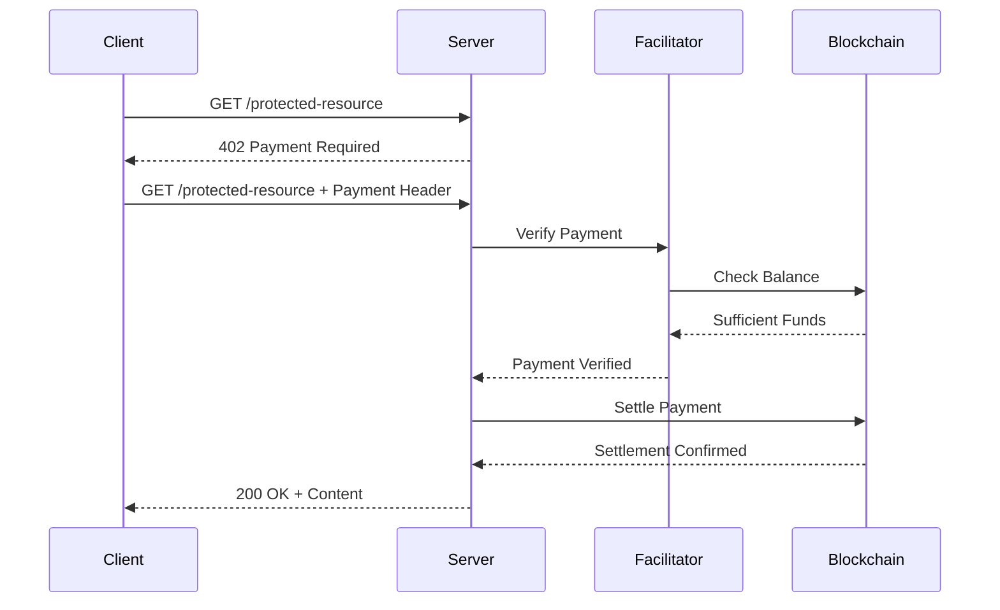

# x402-rs Protocol Compliance Test Harness Plan

## Overview

This document outlines the plan for creating a comprehensive protocol compliance test harness for the x402-rs project. The harness will test various combinations of client, server, and facilitator implementations across multiple chains and protocol versions.

## Current State Analysis

### Existing Implementations

| Component       | Rust Crate               | TypeScript Package | Status                        |
|-----------------|--------------------------|--------------------|-------------------------------|
| **Client**      | `x402-reqwest`           | `@x402/fetch`      | V1, V2 for EVM, Solana, Aptos |
| **Server**      | `x402-axum`              | `@x402/hono`       | V1, V2 middleware             |
| **Facilitator** | `x402-facilitator-local` | `@x402/core`       | Full implementation           |

### Existing TypeScript Tester (`x402-ts-tester`)

The x402-ts-tester provides reference implementations:
- `v1-seller.ts` / `v2-seller.ts` - Server implementations using Hono
- `v1-buyer-evm.ts` / `v2-buyer-evm.ts` - Client implementations
- Manual execution, no automation

## Test Matrix

The test harness supports these axes of configuration (not all combinations are valid):

| x402 Version | Client    | Server    | Facilitator | Namespace | Scheme | Extension                                   |
|--------------|-----------|-----------|-------------|-----------|--------|---------------------------------------------|
| v1           | Rust (rs) | Rust (rs) | Local (rs)  | eip155    | exact  | (none)                                      |
| v2           | TS (ts)   | TS (ts)   | TS (@x402)  | solana    |        | eip2612GasSponsoring (eip155 + exact)       |
|              |           |           | Remote      | aptos     |        | erc20ApprovalGasSponsoring (eip155 + exact) |
|              |           |           |             |           |        | sign-in-with-x                              |
|              |           |           |             |           |        | bazaar (v2 only)                            |

**Naming Convention:** `{x402-version}-{namespace}-{scheme}-{client}-{server}-{facilitator}.{modifier}.test.ts`

Example: `v2-eip155-exact-rs-rs-rs.test.ts` (x402 v2, eip155, exact, Rust Client + Rust Server + Rust Facilitator)
Example: `v2-solana-exact-rs-rs-rs.siwx.test.ts` (with sign-in-with-x modifier)

**Initial Focus Combinations (All Complete):**

| # | Combination              | Client     | Server     | Facilitator | Chain  | Status |
|---|--------------------------|------------|------------|-------------|--------|--------|
| 1 | v2-eip155-exact-rs-rs-rs | Rust       | Rust       | Rust        | eip155 | ✅      |
| 2 | v2-eip155-exact-ts-rs-rs | TypeScript | Rust       | Rust        | eip155 | ✅      |
| 3 | v2-eip155-exact-ts-ts-rs | TypeScript | TypeScript | Rust        | eip155 | ✅      |
| 4 | v2-eip155-exact-rs-ts-rs | Rust       | TypeScript | Rust        | eip155 | ✅      |
| 5 | v2-solana-exact-rs-rs-rs | Rust       | Rust       | Rust        | Solana | ✅      |
| 6 | v2-solana-exact-ts-rs-rs | TypeScript | Rust       | Rust        | Solana | ✅      |
| 7 | v2-solana-exact-rs-ts-rs | Rust       | TypeScript | Rust        | Solana | ✅      |
| 8 | v2-solana-exact-ts-ts-rs | TypeScript | TypeScript | Rust        | Solana | ✅      |

> **Note:** Combination 3 (TS Client + TS Server + Rust Facilitator) is critical for testing the Rust facilitator's compatibility with the canonical TypeScript implementation, isolating any quirks in the Rust facilitator.

## Proposed Structure

```
protocol-compliance/
├── package.json                    # Node.js configuration
├── tsconfig.json                   # TypeScript configuration
├── .env.example                    # Environment template
├── .env                            # Local environment (gitignored)
├── justfile                       # Task runner commands
├── README.md                       # Documentation
├── src/
│   ├── index.ts                   # Main entry point (all tests)
│   ├── cli.ts                      # CLI for manual test invocation
│   ├── utils/
│   │   ├── facilitator.ts         # Facilitator utilities (RSFacilitatorHandle)
│   │   ├── server.ts              # Server utilities (RSServerHandle, TSServerHandle)
│   │   ├── client.ts              # Client utilities (invokeRustClient, makeFetch)
│   │   ├── config.ts              # Configuration management
│   │   ├── process-handle.ts      # Process lifecycle management (ProcessHandle)
│   │   ├── workspace-root.ts      # Workspace root URL reference
│   │   └── waitFor.ts             # Polling utilities (waitForUrl)
│   ├── tests/
│   │   ├── v2-eip155-exact-rs-rs-rs.test.ts        # Rust Client + Rust Server + Rust Facilitator
│   │   ├── v2-eip155-exact-ts-rs-rs.test.ts        # TS Client + Rust Server + Rust Facilitator
│   │   ├── v2-eip155-exact-ts-ts-rs.test.ts        # TS Client + TS Server + Rust Facilitator
│   │   ├── v2-eip155-exact-rs-ts-rs.test.ts        # Rust Client + TS Server + Rust Facilitator
│   │   ├── v2-solana-exact-rs-rs-rs.test.ts        # Rust Client + Rust Server + Rust Facilitator (Solana)
│   │   ├── v2-solana-exact-ts-rs-rs.test.ts        # TS Client + Rust Server + Rust Facilitator (Solana)
│   │   ├── v2-solana-exact-rs-ts-rs.test.ts        # Rust Client + TS Server + Rust Facilitator (Solana)
│   │   └── v2-solana-exact-ts-ts-rs.test.ts        # TS Client + TS Server + Rust Facilitator (Solana)
│   │   # V1 tests and additional chains to be added as needed
│   ├── fixtures/
│   │   └── keys.ts               # Test wallets (from env)
│   └── types/
│       └── index.ts               # TypeScript types
```

## Key Components

### 1. Configuration Management ([`protocol-compliance/src/utils/config.ts`])

```typescript
interface TestConfig {
  facilitator: {
    local: { port: number };
    remote: { url: string };
  };
  server: {
    rust: { port: number; facilitatorUrl: string };
    ts: { port: number; facilitatorUrl: string };
  };
  client: {
    rust: { facilitatorUrl: string };
    ts: { facilitatorUrl: string };
  };
  chains: {
    eip155: { network: string; rpcUrl: string };
    solana: { network: string; rpcUrl: string };
    aptos: { network: string; rpcUrl: string };
  };
  wallets: {
    payer: { eip155: string; solana: string; aptos: string };
    payee: { eip155: string; solana: string; aptos: string };
  };
}
```

### 2. Server Utilities ([`protocol-compliance/src/utils/server.ts`])

The server utilities use a class-based handle pattern for managing server lifecycle:

```typescript
export class RSServerHandle {
  readonly url: URL;
  readonly process: ProcessHandle;

  static async spawn(facilitatorUrl: URL, port?: number): Promise<RSServerHandle>;
  async stop(): Promise<void>;
}

export class TSServerHandle {
  readonly url: URL;
  readonly server: ServerType;

  static async spawn(facilitatorUrl: URL, port?: number): Promise<TSServerHandle>;
  async stop(): Promise<void>;
}
```

**Key Design:**
- **Static `spawn()` method:** Factory method that handles port allocation (via [`get-port`](protocol-compliance/src/utils/server.ts:10)), process spawning, and health check waiting
- **Handle instances:** Contain the server URL and process/server reference for lifecycle management
- **Automatic port selection:** If no port is provided, an available port is automatically selected
- **Health check integration:** Spawning waits for the server to be ready via [`waitForUrl()`](protocol-compliance/src/utils/waitFor.ts)

### 3. Client Utilities ([`protocol-compliance/src/utils/client.ts`])

The client utilities follow a different pattern since clients are not long-running services but rather function calls:

```typescript
// For TypeScript clients: Returns a configured fetch function
export function makeFetch(chain: 'eip155' | 'solana'): typeof fetch;

// For Rust clients: Invokes the binary and returns stdout
export async function invokeRustClient(
  endpoint: URL,
  privateKeys: { eip155: string } | { solana: string }
): Promise<string>;
```

**Key Design:**
- **TS Client ([`makeFetch()`](protocol-compliance/src/utils/client.ts:96)):** Creates an x402-enabled fetch function using `@x402/fetch` with the appropriate chain scheme registered
- **Rust Client ([`invokeRustClient()`](protocol-compliance/src/utils/client.ts:19)):** Spawns the `x402-reqwest-example` binary as a one-shot process, waits for completion, and returns stdout for verification
- **No persistent client handle:** Clients are invoked per-request rather than being started/stopped like servers

### 4. Facilitator Management ([`protocol-compliance/src/utils/facilitator.ts`])

The facilitator uses the same class-based handle pattern as servers:

```typescript
export class RSFacilitatorHandle {
  readonly url: URL;
  readonly process: ProcessHandle;

  static async spawn(port?: number): Promise<RSFacilitatorHandle>;
  async stop(): Promise<void>;
}

export async function getSupportedChains(facilitatorUrl: string): Promise<string[]>;
export function isRemoteFacilitator(url: string): boolean;
```

**Key Design:**
- **Static `spawn()` method:** Similar to servers, handles port allocation, binary execution, and health checks
- **Binary execution:** Runs the pre-built `target/debug/x402-facilitator` binary (not via cargo run)
- **Configuration:** Uses [`protocol-compliance/test-config.json`](protocol-compliance/test-config.json) for facilitator configuration
- **Process management:** Uses [`ProcessHandle`](protocol-compliance/src/utils/process-handle.ts:23) for consistent process lifecycle management across Rust components

**Note:** The local facilitator binary is expected to be pre-built at `target/debug/x402-facilitator`.

### 5. Test Framework

Uses **Vitest** for test execution with the following patterns:

```typescript
import { describe, it, expect, beforeAll, afterAll } from 'vitest';
import { RSFacilitatorHandle } from '../utils/facilitator.js';
import { RSServerHandle } from '../utils/server.js';
import { invokeRustClient } from '../utils/client.js';
import { config } from '../utils/config.js';

describe('v2-eip155-exact-rs-rs-rs: x402 v2, eip155, exact, Rust Client + Rust Server + Rust Facilitator', () => {
  let facilitator: RSFacilitatorHandle;
  let server: RSServerHandle;

  beforeAll(async () => {
    facilitator = await RSFacilitatorHandle.spawn();
    server = await RSServerHandle.spawn(facilitator.url);
  }, 120000); // 2 minute timeout for starting services

  afterAll(async () => {
    await server.stop();
    await facilitator.stop();
  });

  it('should return 402 Payment Required when no payment header', async () => {
    const response = await fetch(new URL('./static-price-v2', server.url));
    expect(response.status).toBe(402);
  });

  it('should return 200 OK and VIP content when payment is provided via Rust client', async () => {
    const privateKey = config.wallets.payer.eip155;
    const endpoint = new URL('./static-price-v2', server.url);
    const stdout = await invokeRustClient(endpoint, { eip155: privateKey });
    expect(stdout).toContain('VIP content from /static-price-v2');
  });
});
```

**Key Patterns:**
- **Handle-based lifecycle:** Facilitator and server handles are created via static `spawn()` methods and stopped via `stop()`
- **No persistent client:** Rust clients are invoked per-test using [`invokeRustClient()`](protocol-compliance/src/utils/client.ts:19); TS clients use [`makeFetch()`](protocol-compliance/src/utils/client.ts:96)
- **Automatic port allocation:** No hardcoded ports - handles select available ports automatically
- **Extended timeouts:** `beforeAll` uses 120s timeout to account for binary startup and compilation if needed
- **URL objects:** Uses `URL` class for proper URL construction instead of string concatenation

## Command Interface

### All-in-One Test Execution

```bash
# Run all tests
just test-all

# Run specific test category
just test eip155           # eip155-only tests
just test solana           # Solana-only tests
just test compat           # Compatibility tests

# Run with verbose output
just test-all --verbose

# Generate coverage report
just test-coverage
```

### Manual Test Invocation

```bash
# Single combination test
protocol-compliance run --client rs --server rs --facilitator rs --chain eip155 --version v2

# Debug mode with logs
protocol-compliance run --client rs --server rs --chain eip155 --verbose --debug
```

### Facilitator Management

```bash
# Run local facilitator (uses config.json in facilitator folder)
cargo run --package facilitator -- --config facilitator/config.json
```

## Test Scenarios

### 1. Basic Payment Flow



### 2. Test Cases

| Test Case              | Description               | Expected Result |
|------------------------|--------------------------|-----------------|
| Happy Path             | Complete payment flow    | 200 OK + "This is a VIP content!" |

> **Note:** Error cases (missing payment, insufficient funds, invalid signature, etc.) are tested per-component, not in E2E harness.

### Additional Utilities

#### Process Management ([`protocol-compliance/src/utils/process-handle.ts`])

```typescript
export class ProcessHandle {
  static spawn(role: string, ...args: Parameters<typeof spawn>): ProcessHandle;
  waitExit(): Promise<void>;
  async stop(): Promise<void>;
}
```

**Purpose:** Wraps Node.js ChildProcess for consistent logging (with role-based prefixes) and lifecycle management across Rust binary invocations.

#### Workspace Root ([`protocol-compliance/src/utils/workspace-root.ts`])

```typescript
export const WORKSPACE_ROOT: URL;
```

**Purpose:** Provides a consistent reference to the repository root for resolving binary paths and config files.

## Implementation Tasks

### Phase 0: Infrastructure Setup ✅ DONE

- [x] Create `protocol-compliance/` directory structure
- [x] Set up `package.json` with dependencies
- [x] Configure TypeScript and Vitest
- [x] Create environment configuration template
- [x] Set up justfile commands
- [x] **Ensure it runs and works as expected**

### Phase 1: v2-eip155-exact-rs-rs-rs Scenario ✅ DONE

**Scenario:** Rust Client + Rust Server + Rust Facilitator + eip155 + exact

- [x] Write `v2-eip155-exact-rs-rs-rs.test.ts` with happy path test

### Phase 2: v2-eip155-exact-ts-rs-rs Scenario ✅ DONE

**Scenario:** TS Client + Rust Server + Rust Facilitator + eip155 + exact

- [x] Write `v2-eip155-exact-ts-rs-rs.test.ts` with happy path test

### Phase 3: v2-eip155-exact-ts-ts-rs Scenario ✅ DONE

**Scenario:** TS Client + TS Server + Rust Facilitator + eip155 + exact

- [x] Write `v2-eip155-exact-ts-ts-rs.test.ts` with happy path test

### Phase 4: v2-eip155-exact-rs-ts-rs Scenario ✅ DONE

**Scenario:** Rust Client + TS Server + Rust Facilitator + eip155 + exact

- [x] Write `v2-eip155-exact-rs-ts-rs.test.ts` with happy path test

> **Note:** All four v2-eip155-exact scenarios are now complete and use programmatic lifecycle management.

### Phase 2.5: Programmatic Server/Client Management ✅ DONE

**Goal:** All servers and clients are started programmatically via `beforeAll()` hooks.

**Completed:**
- [x] Implemented `RSServerHandle.spawn()` in `server.ts` to spawn x402-axum-example binary
- [x] Implemented `TSServerHandle.spawn()` in `server.ts` to create Hono-based TypeScript servers
- [x] Implemented `RSFacilitatorHandle.spawn()` in `facilitator.ts` to spawn x402-facilitator binary
- [x] Implemented `invokeRustClient()` in `client.ts` to invoke x402-reqwest-example as one-shot process
- [x] Implemented `makeFetch()` in `client.ts` to create x402-enabled fetch functions for TypeScript clients
- [x] All v2-eip155-exact tests use programmatic lifecycle management

**Key Design Decisions:**
- **Class-based handles** with static `spawn()` factory methods for consistent lifecycle management
- **Automatic port allocation** using `get-port` to avoid conflicts
- **ProcessHandle abstraction** for consistent process management across Rust components
- **Binary execution** rather than `cargo run` for faster startup
- **One-shot Rust client** invocation rather than persistent client process (clients are request-scoped)

### Phase 5: v2-solana-exact Scenarios ✅ DONE

**Completed Solana test scenarios:**

| Test File                          | Client     | Server     | Facilitator | Status |
|------------------------------------|------------|------------|-------------|--------|
| `v2-solana-exact-rs-rs-rs.test.ts` | Rust       | Rust       | Rust        | ✅      |
| `v2-solana-exact-ts-rs-rs.test.ts` | TypeScript | Rust       | Rust        | ✅      |
| `v2-solana-exact-rs-ts-rs.test.ts` | Rust       | TypeScript | Rust        | ✅      |
| `v2-solana-exact-ts-ts-rs.test.ts` | TypeScript | TypeScript | Rust        | ✅      |

**Implementation Details:**
- Solana chain configuration added to [`config.ts`](protocol-compliance/src/utils/config.ts) with `solanaDevnet` config
- [`invokeRustClient()`](protocol-compliance/src/utils/client.ts:19) updated to support Solana private keys via `SOLANA_PRIVATE_KEY` and `SOLANA_RPC_URL` env vars
- [`makeFetch()`](protocol-compliance/src/utils/client.ts:96) updated to be async and properly initialize Solana client using `createKeyPairSignerFromBytes` from `@solana/kit` with base58 decoding
- All 4 Solana test files follow the same pattern as EIP155 tests with programmatic lifecycle management

> **Note:** All Solana scenarios are now complete and use programmatic lifecycle management.

### Future Work (Out of Scope here)

Extensions are part of this repository but not yet implemented:
- eip2612GasSponsoring, erc20ApprovalGasSponsoring, sign-in-with-x, bazaar
- Tests will be added when extensions are implemented

#### Aptos Support (Future Work)

Aptos chain support requires additional setup and is planned for future phases:
- [ ] Add Aptos chain configuration to test-config.json
- [ ] Write `v2-aptos-exact-rs-rs-rs.test.ts` - Rust client + Rust server
- [ ] Write `v1-aptos-exact-rs-rs-rs.test.ts` - V1 Rust tests

### Phase 6: CLI and Integration

- [ ] Build CLI for manual test invocation
- [ ] Add `just` commands for all operations

## Environment Variables

```bash
# Required
BASE_SEPOLIA_RPC_URL=http://rpc.example.com/
BASE_SEPOLIA_BUYER_PRIVATE_KEY=0xPrivateKey
BASE_SEPOLIA_FACILITATOR_PRIVATE_KEY=0xPrivateKey

SOLANA_DEVNET_RPC_URL=http://rpc.example.com/
SOLANA_DEVNET_BUYER_PRIVATE_KEY=PrivateKeyB58
SOLANA_DEVNET_FACILITATOR_PRIVATE_KEY=PrivateKeyB58
```

## Dependencies

```json
{
  "devDependencies": {
    "typescript": "^5.9.3",
    "vitest": "^2.1.8",
    "@types/node": "^22.10.2",
    "tsx": "^4.21.0"
  },
  "dependencies": {
    "@x402/fetch": "^2.2.0",
    "@x402/hono": "^2.2.0",
    "@x402/core": "^2.2.0",
    "@x402/evm": "^2.2.0",
    "@x402/svm": "^2.2.0",
    "hono": "^4.11.4",
    "viem": "^2.44.2",
    "@solana/kit": "^5.4.0",
    "dotenv": "^17.2.3"
  }
}
```

## Justfile Commands

```makefile
# Run all tests
test-all:
    cd protocol-compliance && pnpm test

# Run specific test file
test FILE='':
    cd protocol-compliance && pnpm vitest run {{FILE}}

# Run specific test by name pattern
test-pattern PATTERN='':
    cd protocol-compliance && pnpm vitest run -t {{PATTERN}}

# Watch mode
test-watch:
    cd protocol-compliance && pnpm vitest

# Run CLI manually
run ARGS='':
    cd protocol-compliance && pnpm tsx src/cli.ts {{ARGS}}

# Facilitator management (uses cargo package from /facilitator folder)
facilitator-start:
    cargo run --package facilitator -- --config facilitator/config.json

facilitator-stop:
    pkill -f "cargo run --package facilitator"

facilitator-logs:
    tail -f facilitator.log

# Install dependencies
install:
    cd protocol-compliance && pnpm install

# Type check
typecheck:
    cd protocol-compliance && pnpm tsc --noEmit
```

## Next Steps

1. ✅ **Phase 5 implementation** - All 4 Solana scenarios complete
2. **Future work** - Aptos support, extensions (eip2612GasSponsoring, etc.)
3. **Iterative implementation** - Continue with remaining phases as needed

## Summary

All 8 initial focus combinations are now complete:
- **4 EIP155 scenarios**: All combinations of Rust/TypeScript clients and servers with Rust facilitator
- **4 Solana scenarios**: All combinations of Rust/TypeScript clients and servers with Rust facilitator

The test harness now provides comprehensive coverage for both EIP155 and Solana chains across all client/server implementation combinations.
